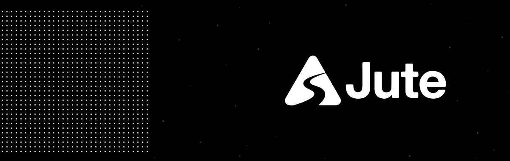

  

# Jute Dash

Jute Dash is a local-first, privacy-respecting home assistant surface designed for bring-your-own agents. It targets tablet kiosks, desktop surfaces, and browser displays, utilizing a modular widget structure and standard agent protocols.

The foundation is built on:
- **Local-first Hub**: A headless-capable Go daemon managing configuration, SQLite-backed persistence, event streaming, wake words, local API routes, and agent connectivity.
- **Dynamic Display**: A premium SvelteKit kiosk and PWA app built with shadcn-svelte conventions.
- **BYO Agents (A2A)**: Zero-lockin integration of agentic models via standard Agent to Agent (A2A 1.0) protocol bindings.
- **Local MCP Context**: A built-in MCP bridge that securely feeds dashboard context and widget skills directly to conversation agents without exposing raw databases or secret credentials.

---

## Technical Architecture Docs

Before making product changes or contributions, read the design documents in `docs/architecture/`:

- [System Architecture](docs/architecture/system.md)
- [Configuration and Persistence](docs/architecture/configuration-persistence.md)
- [Display UX](docs/architecture/display-ux.md)
- [Visual Customization (Themes)](docs/architecture/visual-customization.md)
- [Resilience and Error UX](docs/architecture/resilience-error-ux.md)
- [Widgets](docs/architecture/widgets.md)
- [Widget Skills](docs/architecture/widget-skills.md)
- [A2A Compatibility](docs/architecture/a2a.md)
- [MCP Bridge](docs/architecture/mcp-bridge.md)
- [Voice & Wake Word Architecture](docs/architecture/voice.md)
- [Text-To-Speech (TTS)](docs/architecture/text-to-speech.md)
- [Security and Privacy](docs/architecture/security-privacy.md)

---

## Getting Started

If you want to set up your development environment, run the tests, or spin up the full-stack examples (like the Mock or Kronk agents), please refer to:

👉 **[CONTRIBUTING.md](CONTRIBUTING.md)**

---

## License

Jute Dash is open-source software licensed under the [GNU Affero General Public License v3.0](LICENSE) (`AGPL-3.0-only`).
