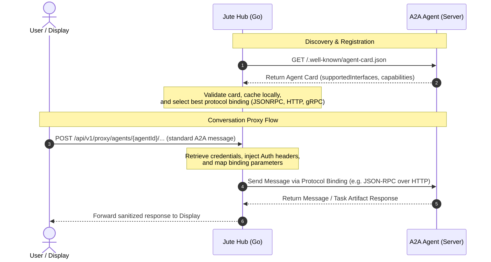

# A2A Compatibility

## Compatibility Target

Jute targets A2A 1.0 and treats A2A as the external agent interoperability layer. Jute is an A2A client and local orchestrator. Remote or local agents are A2A servers.

The optional [MCP Bridge](mcp-bridge.md) is complementary. A2A remains the conversation and task protocol. MCP is a richer local pull/tool surface for trusted agents that can connect to the hub. Widget capabilities exposed through MCP are defined by [Widget Skills](widget-skills.md).

Primary references:

- [A2A specification](https://a2a-protocol.org/latest/specification/)
- [A2A extensions](https://a2a-protocol.org/latest/topics/extensions/)
- [A2A agent discovery](https://a2a-protocol.org/latest/topics/agent-discovery/)
- [A2A custom protocol bindings](https://a2a-protocol.org/latest/topics/custom-protocol-bindings/)

## Discovery

Agents are registered by direct configuration, registry lookup, or well-known Agent Card URL. Public agents should normally expose:

```text
https://{agent-domain}/.well-known/agent-card.json
```

The discovery and messaging flow follows this sequence:



The hub resolves the Agent Card, validates it, caches it, and records:

- identity and provider metadata;
- `supportedInterfaces`;
- capabilities, including streaming and extensions;
- skills and supported input/output modes;
- security requirements;
- icon and documentation links.

Agent Card discovery is an outbound network request owned by the hub. To avoid request-forgery risks, the hub only fetches Agent Cards whose URLs match the configured A2A allow policy. The standard local development Agent Card URLs on `127.0.0.1:9797` and `localhost:9797` are allowed by default. Other local ports and remote Agent Card URLs must be listed as exact entries under `a2a.allowed-agent-card-urls`. Agent Card URLs must use `http` or `https` and must not include user info, query strings, or fragments.

## Protocol Binding Selection

Jute does not create a custom protocol binding for v1. It selects from standard A2A bindings in this order:

1. `JSONRPC`
2. `HTTP+JSON`
3. `GRPC`

The hub reads the Agent Card `supportedInterfaces` list in preference order and chooses the first interface that both the agent and Jute support. If no compatible binding exists, the agent is visible as incompatible and cannot be selected for tasks.

## Credentials

Agent Card security metadata describes requirements, but credentials are supplied out of band. Jute config stores credential references, not raw secrets.

v1 credential sources:

- environment variable reference;
- local development token file outside repo paths when explicitly configured.

Future credential sources:

- OS keyring;
- OAuth device flow;
- mTLS identity;
- household pairing service.

The display never receives raw agent credentials.

## Messaging And Streaming

User turns in the display use the A2A JavaScript SDK against the hub's authenticated agent proxy. The hub owns Agent Card discovery, binding and endpoint selection, credential lookup, and authorization-header injection; it forwards standard A2A requests and responses instead of replacing them with Jute-specific conversation methods. Conversation history is agent-backed through standard `ListTasks` and `GetTask` operations sent through the proxy.

Voice turns follow the same path after transcription. The Jute Voice Service sends final transcripts to the hub; the hub sends text turns to A2A agents. Raw microphone audio, pre-roll buffers, and partial transcripts are not sent to A2A agents.

For agents that support streaming, Jute uses the streaming operation for responsive dashboard updates. For agents without streaming, the hub uses blocking send. For agents that do not expose task history, the display shows a history-unavailable state instead of inventing local history.

Current implementation status:

- JSON-RPC A2A 1.0 blocking chat is implemented with `SendMessage`.
- JSON-RPC A2A 1.0 streaming chat is implemented with `SendStreamingMessage`.
- JSON-RPC A2A 1.0 task history is implemented with `ListTasks` and `GetTask`.
- The display selects streaming only when the discovered Agent Card declares streaming support; other agents use blocking `SendMessage`.
- Active display turns are abortable across streaming, blocking, and history requests. Local cancellation does not automatically resend the user turn.
- Direct `Message` results and text parts from task artifacts render without requiring task-history support.
- Explicit history capability failures produce a history-unavailable state. Proxy, network, and authentication failures remain operational errors instead of being mislabeled as unsupported history.
- Terminal failed, rejected, and canceled task states stop the turn without a follow-up history request.
- The display's A2A client sends `A2A-Version: 1.0`.
- The display currently pins `@a2a-js/sdk` `1.0.0-alpha.0` because the npm `latest` tag remains on the incompatible 0.3 protocol line. Replace the alpha pin with the first compatible stable 1.0 release after verification.
- The hub does not persist conversation transcripts locally in the current pre-v1 implementation. A2A agents remain the source of task and message history.
- The display sends A2A requests to `/api/v1/proxy/agents/{agentId}`.
- Rich event replay, polling, and task subscriptions remain future work.

## Agent Card Caching

The hub honors standard HTTP caching headers when fetching Agent Cards:

- use `ETag` with `If-None-Match` when available;
- use `Last-Modified` with `If-Modified-Since` when available;
- use a conservative default cache duration when no caching headers are present;
- refresh manually when the user asks or when a task fails due to capability mismatch.

Cached cards are refreshable implementation detail. The current pre-v1 hub keeps discovered card metadata in memory while the process runs; a later cache may store fetch time, expiry, ETag, content hash, and selected interface.

Current implementation status:

- The hub fetches configured Agent Cards, selects A2A 1.0 `JSONRPC` first, and exposes the selected interface, skills, streaming flag, dashboard-context support, and safe card status to the UI.
- The development harnesses under `examples/harnesses/` are self-contained full-stack examples with embedded fixture modules.

## Jute Dashboard-Context Extension

Jute-specific dashboard context uses an optional A2A extension:

```text
https://jute.dev/a2a/extensions/dashboard-context/v1
```

Agents declare support in their Agent Card capabilities. Jute activates the extension only for agents that declare support.

The extension payload travels in A2A message metadata. It does not add fields to core A2A types and does not change protocol binding behavior.

Payload shape:

```json
{
  "schema": "https://jute.dev/a2a/extensions/dashboard-context/v1",
  "display": {
    "deviceId": "kitchen-display",
    "profile": "wall-display",
    "locale": "en-GB",
    "timezone": "Europe/London",
    "interactionMode": "touch"
  },
  "dashboard": {
    "layoutId": "morning",
    "visibleWidgetIds": ["clock", "weather", "energy"],
    "focusedWidgetId": "energy"
  },
  "widgets": [
    {
      "id": "energy",
      "kind": "energy.summary",
      "title": "Energy",
      "size": "medium",
      "publicContext": {
        "currentPrice": "21.2p/kWh",
        "nextCheapWindow": "22:30"
      }
    }
  ]
}
```

The hub redacts or omits:

- hidden widgets;
- private widget state;
- raw smart-home payloads not explicitly exposed;
- secrets and credential references;
- camera frames, audio, transcripts, and precise presence data unless the user grants a future explicit permission.

## MCP Bridge Relationship

A2A dashboard-context metadata is the compact push path. It is appropriate for remote or cloud agents and for agents that do not connect to local MCP.

The MCP Bridge is the richer pull path for trusted local agents. It exposes safe dashboard context, Widget Skills, and hub-mediated actions as MCP resources, prompts, and tools. It does not replace A2A task messaging and does not create a custom A2A protocol binding.

Remote agents do not receive MCP credentials automatically. If an agent cannot use MCP, it still receives the user's turn through standard A2A and may receive compact dashboard context only when it declares the Jute A2A extension.

## Graceful Degradation

If an agent also lacks MCP access, it must proceed without local dashboard resources or Jute tools.

## Agent Request Proxy

The hub exposes `/api/v1/proxy/agents/{agentId}/*` so the display can use the standard A2A JavaScript SDK while credentials remain inside the hub.

- The display app sends standard A2A JSON-RPC/HTTP requests to this proxy endpoint.
- The hub resolves the endpoint selected from the current Agent Card, looks up credentials configured for `{agentId}`, injects them into the outgoing authorization headers, and forwards the request.
- The proxy rejects unknown and disabled agents.
- The proxy rejects requests when an agent requires credentials that the hub cannot resolve.
- The proxy does not expose credential values or credential references to the display.

## Future Roadmap & Extension Plans

### Rich Artifacts Pass-Through
To enable visual widgets, map views, or interactive controls generated by remote agents to render on the touch dashboard:
- Jute Hub will support forwarding raw, structured A2A `Artifact` payloads directly to the Svelte display under an `artifact_update` event.
- The hub persists these in SQLite as raw JSON blobs for conversation history, but acts as a pass-through layer rather than attempting to parse or validate custom layout structures. Svelte display components render the dynamic artifacts natively.
- Plain text artifact parts already render as assistant chat messages; this roadmap item covers structured and interactive artifact rendering.

### Dynamic Tool and Task Statuses
For real-time tool execution visibility (e.g. showing "(Querying Weather Widget...)" or "(Searching...)"):
- Jute Hub's A2A streaming client forwards the text/message payload of `statusUpdate` events (`status.message`) in the `EventStatusChanged` event.
- Svelte displays these transient status messages next to the thinking animation in the chat header, ensuring the user has a responsive view of what the agent is currently doing without cluttering the chat history.

### Voice Modality & Voice-Profile Extension
To integrate voice turns with native A2A modalities:
- When initiating voice turns, Jute Hub lists both `text/plain` and accepted audio types (e.g., `audio/wav`) in `params.configuration.acceptedOutputModes`.
- A Jute-specific voice profile extension (`https://jute.dev/a2a/extensions/voice-profile/v1`) will be declared in request metadata, passing user-configured TTS settings (preferred voice ID, speed) to let the agent natively optimize and synthesize audio segment responses.
