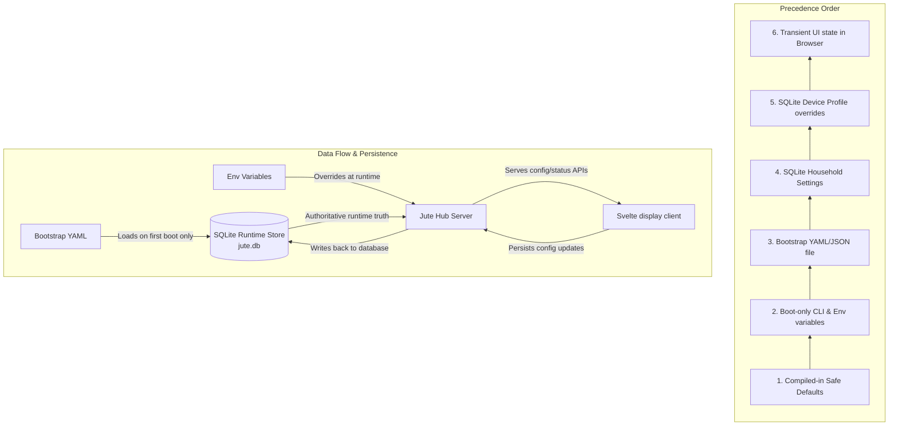

# Configuration And Persistence

## Goal

Jute should be easy to run out of the box without hand-editing files, but advanced users still need portable configuration, mounted config files, environment overrides, and future import/export.

The decision:

- YAML is the preferred bootstrap, import, and export format.
- JSON remains supported for machine-friendly compatibility.
- SQLite is runtime truth.
- Pre-v1 agent registrations are saved back to the active YAML config file so local development can add, disable, and remove A2A agents without a settings database editor.
- Secrets are references only.
- The hub owns all durable settings.
- Browser state is transient only.

## Storage Stack

Use SQLite for the runtime store. Jute Hub utilizes the [GORM](https://gorm.io/) ORM with the standard [gorm.io/driver/sqlite](https://github.com/go-gorm/sqlite) driver.

Use SQLite WAL mode for normal runtime. [SQLite WAL](https://www.sqlite.org/wal.html) allows readers and writers to proceed concurrently, which fits Jute's shape: the hub is the single writer, while displays, widgets, and local tools mostly read.

Runtime rules:

- open the database through the `apps/hub/internal/pkg/database` and `apps/hub/internal/app/store.go` persistence modules;
- run migrations before serving APIs;
- enable WAL mode for normal local filesystems;
- do not place the runtime database on a network filesystem;
- keep one hub process as the writer for a household;
- expose settings only through hub APIs.

## Configuration Layers

Effective configuration is built in this order of precedence (highest overriding lowest):



Boot-only values include:

- config path;
- data directory;
- listen address;
- headless mode;
- development asset overrides;
- log level.

Boot-only values are not treated as ordinary persisted settings unless the user explicitly saves them through a future settings flow.

## Local Paths

`JUTE_HOME` is the primary local data root.

Default data roots:

- macOS: `~/Library/Application Support/Jute Dash`
- Linux: `$XDG_DATA_HOME/jute-dash` or `~/.local/share/jute-dash`
- Windows: `%AppData%/Jute Dash`
- Docker: `/data`
- systemd: `/var/lib/jute`

Default runtime database:

```text
$JUTE_HOME/jute.db
```

Default bootstrap config:

- development: `examples/config/local/config.yaml`;
- Docker: `/config/config.yaml`;
- systemd: `/etc/jute/config.yaml`;
- ordinary local install: optional.

No bootstrap config is required for first run.

## First Run

When no runtime database exists, the hub:

1. creates the data directory;
2. creates `jute.db`;
3. runs all migrations;
4. inserts safe defaults;
5. applies bootstrap YAML or JSON if a bootstrap file was provided;
6. exposes setup status through the local API.

The first-run UI should collect only the minimum useful settings:

- home name;
- locale and timezone;
- weather enabled state and lat/lon location;
- default display profile;
- optional first A2A agent;
- optional voice provider choices when voice is enabled.

Production first-run should not include fake remote agents or call remote services until the user configures them. The existing example config can stay richer for development demos.

## Runtime Store Model

Jute uses `apps/hub/internal/pkg/database` for database connection pragmas, and `apps/hub/internal/app/store.go` as the runtime persistence wrapper, built on [GORM](https://gorm.io/) and SQLite (`gorm.io/driver/sqlite`).

The store owns:

- database opening and pragmas;
- migrations;
- transactions;
- backup/export helpers;
- setting reads and writes;
- redacted public projections.

Add an app-managed migration table:

```sql
CREATE TABLE schema_migrations (
  version INTEGER PRIMARY KEY,
  name TEXT NOT NULL,
  applied_at TEXT NOT NULL
);
```

Use normalized tables for stable product concepts, with JSON columns only for flexible non-secret settings.

Initial table families:

- `household_settings`
- `device_profiles`
- `layout_profiles`
- `rooms`
- `tiles`
- `widget_packs`
- `widget_instances`
- `widget_permissions`
- `voice_provider_packs`
- `voice_settings`
- `mcp_settings`
- `agent_mcp_scopes`
- `adapter_connections`
- `setting_audit_log`

Provider manifests and widget manifests are validated records. They are not executable code and are not durable sources of truth outside the hub store. A2A agent registrations are YAML-backed in the current pre-v1 implementation; a later settings store migration may promote agents into normalized tables after the add/edit UX has settled.

`voice_settings` stores per-device wake model ID, wake phrase, wake sensitivity threshold, selected STT/TTS providers, TTS model/voice/locale/speed/volume, follow-up timing, and privacy controls. `voice_provider_packs` stores validated provider manifests and safe health metadata, including wake-word provider model summaries and TTS voice metadata without credential values or raw audio.

Use stable string IDs for user-facing records so import/export and future sync can preserve identity.

Use UTC ISO-8601 strings for public API timestamps.

## Setting Classification

Before adding a new setting, classify it as one of:

- `boot-only`: read from CLI/env at process start and not modified by UI.
- `household durable`: shared setting stored in SQLite.
- `device-profile durable`: per-display or per-headless-node override stored in SQLite.
- `install record`: widget pack, voice provider pack, adapter, or agent registration metadata.
- `theme install record`: Theme Pack manifest and validated local assets.
- `cache`: refreshable data such as Agent Cards, health checks, provider status, and weather snapshots.
- `secret reference`: environment variable name, keyring key, or OAuth credential reference.
- `transient UI state`: open menus, drag state, local focus state, and unsaved form edits.
- `local media asset`: hub-managed binary media such as uploaded background images, stored under the hub data directory and referenced by id/path, never inlined into config or public API responses.

Classification of the new display/widget settings:

- dashboard screen definitions, screen-owned widget instances, widget instance `mode` (`ui`/`headless`), non-secret widget settings values, `connectionRefs`, and responsive layout variants are `household durable` (SQLite truth, YAML bootstrap/export);
- the current active dashboard screen is durable display/profile state. Until full device-profile settings are exposed, the default display/profile path stores it with the active layout profile;
- Adapter Connections are `household durable` records shared across widget instances;
- Adapter Connection `secretRefs` are `secret reference` values. The hub may resolve them into raw provider material in process memory, but public APIs, YAML/JSON export, widget snapshots, A2A context, and MCP resources expose references or redacted availability only;
- a widget's settings schema is part of its `install record` / built-in widget metadata (surfaced via the catalog), not a per-home setting;
- the background reference and slideshow configuration (image references, interval, fit, overlay) are `household durable`;
- uploaded background image binaries are `local media assets`.

Do not store durable settings only in browser local storage.

## YAML Bootstrap Format

YAML is the recommended format for hand-authored Jute configuration because it is easier to scan and maintain for homes, agents, widgets, layouts, and future setup records.

Rules:

- `.yaml` and `.yml` are preferred for local bootstrap config;
- `.json` remains accepted for generated config, tests, and compatibility;
- YAML uses kebab-case keys such as `listen-address`, `card-url`, and `wind-speed-unit`;
- YAML decoding is strict and rejects unknown fields;
- YAML is not watched or automatically reloaded in v1.

Jute intentionally does not copy Glance's live config reload model in v1. Most runtime edits happen through the hub and persist to SQLite. The exception in the current pre-v1 implementation is A2A agent registration: adding, enabling/disabling, and removing agents through the UI writes the active YAML config file when the hub was started with a writable `.yaml` or `.yml` config path. Editing YAML by hand is still not watched or automatically reloaded; restart or use future import flows for broader changes.

Conversation transcripts are not stored in YAML, JSON, or SQLite in the current implementation. The display reads history from the selected A2A agent through standard `ListTasks` and `GetTask` requests sent via the hub's authenticated agent proxy.

## Secrets

Secrets are never stored directly in YAML, JSON, or ordinary SQLite settings rows.

v1 secret references:

- environment variable names;
- encrypted local secret-vault records referenced as `db:<secret-id>`;
- local token file references outside repo paths when explicitly configured;
- auth configured booleans in public projections.

Integration Widgets must use Adapter Connections for provider credentials. A Widget Instance stores `connectionRefs` such as `{ "bridge": "living-room-hue" }`; the referenced Adapter Connection stores non-secret adapter settings plus secret references such as `{ "username": "env:HUE_USERNAME" }` or `{ "access_token": "db:spotify/main/access_token" }`. Connection kinds expose typed setup metadata through `/api/v1/settings/connection-kinds`, and the Settings `Connections` surface saves records as `settings` plus `secretRefs`. The hub resolver validates required fields and is the only layer that turns those references into raw material for provider code.

Spotify login uses Authorization Code with PKCE for local/self-hosted setup. A Spotify Adapter Connection may store a non-secret `client_id`, while access and refresh tokens are written as encrypted `db:` secret references by the hub. A Jute-managed Spotify app can be configured with `JUTE_SPOTIFY_CLIENT_ID`, allowing the connection record to omit `client_id`. The Display may request a short-lived Spotify access token from `/api/v1/integrations/spotify/web-playback-token` only to initialize Spotify's Web Playback SDK.

Apple Music uses an Apple Music Adapter Connection with secret references for the MusicKit developer token and optional Music User Token. The Display may request MusicKit token material from `/api/v1/integrations/apple-music/music-kit-token` only to initialize MusicKit JS and authorize browser playback for a linked connection.

Browser playback token material is transient Display runtime material. It must not be persisted in widget settings, browser storage, YAML, exported config, A2A context, MCP context, or logs.

The local secret vault stores encrypted blobs in SQLite and keeps the raw master key out of the database. By default the master key is generated and stored in the host OS credential store. `JUTE_SECRET_KEY` can provide the 32-byte master key for CI, containers, service users, and Linux environments without a usable desktop keyring. The environment override supports base64, hex, or raw 32-byte values.

Supported desktop credential stores are host-dependent: macOS Keychain, Windows Credential Manager, and Linux Secret Service, KWallet, Pass, or KeyCtl. If none is available and `JUTE_SECRET_KEY` is unset, secret resolution fails and Integration Widgets report safe connection issues.

Future secret storage:

- OAuth device flow records;
- encrypted backup/export support.

Public APIs may expose whether a secret is configured. They must not expose raw values.

## Import And Export

YAML export is the preferred human-readable portable projection of runtime settings. JSON export remains available for machine-readable workflows.

Export includes:

- household settings;
- device profiles when selected;
- layouts;
- rooms and tiles;
- agents without raw credentials;
- widget installation records and permissions;
- voice provider pack records and non-secret settings;
- MCP bridge settings and per-agent scopes without raw tokens;
- adapter connection records without raw credentials.

Export excludes by default:

- raw secrets;
- raw transcripts;
- raw audio;
- TTS cache contents;
- Agent Card cache;
- provider health cache;
- logs;
- volatile runtime state.

Import writes through the same validation path as setup/settings APIs. Imports should report conflicts before overwriting existing records.

## APIs

Keep:

- `GET /api/v1/config`: redacted effective public config view.

Setup and settings APIs:

- `GET /api/v1/setup/status`
- `GET /api/v1/settings/household`
- `PATCH /api/v1/settings/household`
- `GET /api/v1/voice/status`
- `PATCH /api/v1/voice/settings`

Voice settings are device-profile durable settings owned by the hub. The display may keep unsaved form edits in memory, but saved voice enablement, provider IDs, wake thresholds, locale, follow-up window, cloud opt-in, command-provider enablement, sensitive-output policy, and microphone profile must be written through the hub API and persisted in SQLite.
- `GET /api/v1/settings/rooms`
- `PUT /api/v1/settings/rooms`
- `GET /api/v1/settings/tiles`
- `PUT /api/v1/settings/tiles`

The current pre-v1 settings UI uses `GET/PATCH /api/v1/settings/household` for home name, locale, timezone, display appearance, weather enablement, location, and units. Household display appearance writes are normalized through the same defaulting and validation rules as config import before they are saved. It also uses `GET/PUT /api/v1/settings/rooms` and `GET/PUT /api/v1/settings/tiles` for the home model shown on the dashboard. Store-backed runs persist these records in SQLite. YAML-backed harness runs write the same records back to the active YAML config.

Future visual customization settings are documented in [Visual Customization](visual-customization.md). Theme selection, color mode, background policy, and default widget chrome are durable display settings. Theme Pack manifests are install records. Per-widget chrome overrides are widget settings.

Future setup and settings APIs:

- `POST /api/v1/setup/complete`
- `GET /api/v1/devices`
- `GET /api/v1/devices/{id}/settings`
- `PATCH /api/v1/devices/{id}/settings`
- `POST /api/v1/config/import`
- `GET /api/v1/config/export`

Future MCP settings APIs:

- `GET /api/v1/mcp/settings`
- `PATCH /api/v1/mcp/settings`
- `GET /api/v1/agents/{id}/mcp-scopes`
- `PATCH /api/v1/agents/{id}/mcp-scopes`

Pre-v1 MCP scopes are configured on each YAML/JSON agent record as `mcp-scopes` / `mcpScopes`. Missing values default to read-only scopes. The bridge uses `X-Jute-Agent-ID` to select the configured agent and apply those scopes.

Settings writes go through the hub, update SQLite or the active YAML harness config, and emit relevant events when those events exist.

Settings-related events:

- `settings.changed`
- `device_profile.changed`
- `home.updated`
- `widget.updated`
- `agent.card_updated`
- `voice.provider_health_changed`

## CLI

Future CLI behavior:

- `juted init`: create the data directory, database, and optional bootstrap config.
- `juted --data-dir`: override runtime data path.
- `juted --config`: provide YAML or JSON bootstrap/import config.
- `juted --listen`: boot-only listen override.

The current `--config` behavior is provisional. Once SQLite persistence exists, `--config` is bootstrap input for an empty store unless an explicit import command is used.

## Backup And Recovery

Use SQLite-aware backup/export paths instead of copying only `jute.db` while the hub is running. WAL mode can create `jute.db-wal` and `jute.db-shm` companion files.

Backup options:

- YAML export for portable, secret-free human configuration;
- JSON export for machine-readable compatibility;
- SQLite backup API for full local backup;
- stopped-service file copy for advanced users;
- future encrypted export for secrets and sensitive history.

Recovery flow:

1. start from safe defaults if no backup exists;
2. restore SQLite backup for full local state;
3. import YAML or JSON for portable settings;
4. reattach secrets through environment variables or future keyring setup.

## Development Defaults

Development keeps using the runnable configs under `examples/config/local/`.

Production defaults should be quieter:

- no fake agent endpoints;
- weather enabled only when a location is configured or accepted in setup;
- loopback listen address;
- no cloud STT/TTS opt-in;
- no command providers enabled;
- no remote access.
