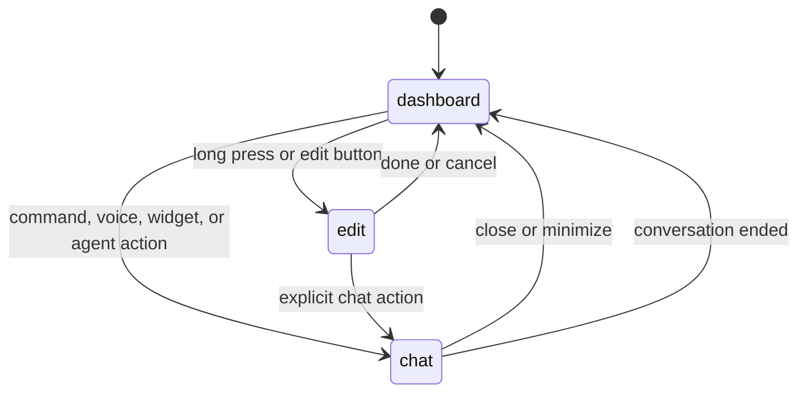

# Display UX

## Goal

This document defines the first real Jute Dash display UX. It covers the dashboard, widget frame system, agent chat mode, transitions, first widgets, and implementation constraints for the SvelteKit display.

Jute should feel calm, direct, and home-native: a useful always-on assistant surface rather than a web admin dashboard.

## Current UI Status

The existing `apps/web` dashboard is throwaway proof-of-concept work.

Rules:

- current CSS classes are not canonical;
- current page layout, side panel, tile structure, and visual styling are not canonical;
- current component names may be reused only if they fit the new architecture;
- future implementation may replace the dashboard UI from scratch;
- only hub API contracts, architecture decisions, and validated product behavior should be preserved.

Do not use screenshots or styles from the current POC as design targets.

## Design Constants

Brand constants:

- light-mode logo source: `/Users/craig/Repos/jute/docs/brand/logo_dark.svg`;
- dark-mode logo source: `/Users/craig/Repos/jute/docs/brand/logo_light.svg`;
- logo treatment: monochrome mark only, no recoloring for v1.

UI system constants:

- use [shadcn-svelte conventions](https://www.shadcn-svelte.com/llms.txt) for buttons, sheets, dialogs, menus, tabs, inputs, scroll areas, command surfaces, and accessible primitives;
- keep cards and widget frames at 8px border radius or less;
- use lucide-svelte icons for common controls;
- keep display text concise and functional.

Palette:

- light mode is BOW: black-on-white;
- dark mode is WOB: white-on-black;
- use neutral gray borders and surfaces;
- reserve non-neutral colors for semantic states such as error, warning, success, active voice, or recording;
- do not introduce a broad brand color palette in v1.

Visual customization is specified in [Visual Customization](visual-customization.md). The BOW/WOB palette is the default `jute-mono` Theme Pack, not a permanent limit on future contributed themes.

## Display Modes

The display has three primary modes:

- `dashboard`: default widget canvas.
- `edit`: dashboard customization mode.
- `chat`: focused agent conversation mode.

The mode is UI state, but durable layout changes are saved through the hub.

## Resilience And Error States

Runtime error behavior is specified in [Resilience And Error UX](resilience-error-ux.md).

Display requirements:

- initial load with no hub shows a full-screen offline state, not a silent fake dashboard;
- runtime hub disconnect keeps the last in-memory dashboard visible, marks it stale, and shows a persistent status ribbon;
- app-level banners are reserved for hub-level or cross-feature issues;
- single-widget failures stay inside `WidgetFrame`;
- no configured or enabled agent is a setup-needed state, not a danger error;
- chat send failures appear inline near the failed turn with retry or cancel where possible.

App connection states:

- `starting`;
- `connected`;
- `reconnecting`;
- `offline`;
- `degraded`.

## Dashboard

The dashboard is the default first screen.

Layout rules:

- date and time appear in the top-left by default;
- top-left date/time uses configured locale and timezone;
- dashboard chrome is minimal: the header shows only a compact, always-visible icon row (chat, voice/mute, edit, settings) and no brand lockup;
- the Jute logo, home name, and active layout profile are not shown on the dashboard; identity moves to `Settings → About`;
- dashboard controls use icons for chat, voice/mute, settings, and edit mode;
- widget canvas scrolls vertically when widgets exceed the viewport;
- horizontal overflow is not allowed;
- widgets are the main content; the dashboard avoids developer-grade clutter.

## Settings UX

The pre-v1 settings surface is an in-app panel opened from the dashboard header, chat empty states, and agent diagnostics.

Initial sections:

- `Household`: home name, timezone, locale, theme, weather enablement, location, coordinates, and units;
- `Rooms`: editable room IDs, names, summaries, and simple status text;
- `Tiles`: editable dashboard tile IDs, kinds, labels, values, and details;
- `Agents`: add an agent by Agent Card URL, enable or disable agents, remove agents, and refresh Agent Cards;
- `MCP`: read-only bridge status and startup configuration summary;
- `Voice`: read-only voice/provider status until provider selection is implemented;
- `Appearance`: theme, color mode, density, and background — including background image upload, the local image library, single-image vs slideshow selection, slideshow interval, and fit/overlay;
- `About`: home name, active layout profile, version, setup, config mode, and enabled-agent summary.

Settings writes go through the hub. Store-backed runs persist to SQLite. YAML-backed local harnesses persist the same records to the active YAML config for easy developer iteration. Browser storage is not durable settings storage.

Responsive behavior:

- the dashboard layout is authored once on a **12-column base grid** and stored at that resolution; on every real screen (desktop, tablet, edge kiosk) the display renders that **same layout, scaled to fill the viewport** — there is no column remap or widget reflow, so a layout configured on a desktop looks identical on a smaller edge device;
- the grid is **fully proportional**: both columns and rows are `1fr` tracks. The number of rows equals the configured layout's vertical extent (`max(y + h)`), so the whole grid fills the viewport height with no scrolling. Cell aspect ratio flexes with the device; arrangement and relative sizes are preserved;
- **widgets own their content sizing**: each widget frame is a CSS [size container](https://developer.mozilla.org/en-US/docs/Web/CSS/CSS_containment/Container_queries) and widget fonts, icons, and padding scale with the cell using container-query units (`cqmin`). Avoid fixed `px`/`rem` sizing inside widgets;
- the only exception is a **narrow-phone fallback (≤640px)**: the grid collapses to a single scrolling column of content-height tiles (fine drag/resize disabled; reorder via the ⋯ menu). At this width frames switch to an inline-size container with fixed-size fallbacks (an inline-size container has no block axis, so `cqmin` would collapse to zero);
- overlays (settings panel, widget catalog, widget settings sheet, chat) present as full-width bottom sheets on phones and as centered panels/dialogs on larger screens;
- large wall displays may keep chat as a side focus area, but ordinary displays use full chat focus mode.

Spacing:

- base spacing unit is 8px;
- outer page padding defaults to 16px on small screens and 24px on larger screens;
- grid gaps default to 12px or 16px depending on density;
- touch targets are at least 44px.

## Dashboard Grid

The dashboard grid is draggable and resizable.

Persisted widget layout fields (all coordinates are on the **12-column base grid**):

- `id`: widget instance ID;
- `kind`: widget kind matching the widget's registered type;
- `x`: grid column start (0–11);
- `y`: grid row start;
- `w`: grid width in base columns;
- `h`: grid height in row units;
- `minW`: minimum grid width;
- `minH`: minimum grid height;
- `size`: named size such as `small`, `medium`, `wide`, or `large`;
- `mode`: `ui` (renders a tile) or `headless` (no tile; still fetches data and feeds the agent — see [Widgets](widgets.md));
- `settings`: non-secret widget settings;
- `visible`: whether the widget instance exists on the current profile (a removed widget sets `visible: false`; this is distinct from `mode`).

Layouts stored before the 12-column grid (4-column coordinates) are migrated on load by scaling `x`/`w` ×3.

Implementation guidance:

- v1 uses a small custom Svelte grid editor for the built-in widget set;
- the base grid is 12 columns; rows are proportional (`1fr`) and the rendered row count follows the layout's extent. Drag and resize snap to base cells — edit-mode pixel↔cell math measures the actual rendered cell width and row step from the DOM (rows are not a fixed pixel height);
- the stored layout is always 12-column and renders identically at every size by scaling; only the ≤640px phone fallback collapses to a single column, and it never overwrites the base;
- revisit a proven Svelte-compatible drag/resize grid library only when denser layouts make the custom editor too costly;
- preserve layout through hub APIs, not browser local storage;
- debounce layout saves while dragging;
- commit the final layout when drag or resize ends;
- keep keyboard alternatives for move and resize.

Current v1 layout APIs:

- `GET /api/v1/widgets/catalog`: built-in widget catalog.
- `GET /api/v1/widgets/layout`: current device layout profile.
- `PUT /api/v1/widgets/layout`: replace the current layout with a validated full layout document.
- `POST /api/v1/widgets/layout/reset`: restore the default built-in layout.

Widget additions can come from:

- setup config bootstrap;
- SQLite layout settings;
- in-app widget catalog.

## Edit Mode

Edit mode is activated by:

- long press on touch;
- explicit edit button on desktop and keyboard/remote surfaces.

Long press defaults:

- press duration: 650ms;
- cancel when the pointer moves beyond a small drag threshold;
- provide haptic feedback where the platform allows it.

Edit mode supports:

- add widget (as a tile or as a headless context-only instance);
- move widget;
- resize widget;
- remove widget;
- configure widget;
- toggle a widget between `ui` and `headless` mode;
- duplicate widget when the widget supports multiple instances;
- reset layout profile.

Edit mode UI:

- direct manipulation is primary: drag a tile to move, drag its corner to resize, snapping to the 12-column base grid;
- per-tile controls collapse into a single overflow (⋯) menu offering Configure, Make headless / Restore to dashboard, and Remove — not a cluster of always-visible buttons;
- Configure opens the schema-driven widget settings sheet (see [Widgets](widgets.md)); it includes frame settings (title, chrome, size) and the `ui`/`headless` toggle;
- headless instances do not appear on the grid; edit mode shows a **headless tray** listing them as chips for configure/restore/remove;
- arrow/size keyboard nudges remain available as a focus-visible accessibility fallback, not as always-visible buttons;
- show a subtle grid overlay;
- show a top or bottom edit toolbar with Add widget, Reset, and clear Done and Cancel actions;
- avoid accidental deletes by requiring confirmation or undo.

Edit mode by device:

- on tablet and desktop, full placement editing (drag move, corner resize) is available;
- on phones (≤640px) the layout collapses to a single scrolling column, so fine drag/resize is disabled; edit mode there allows reorder (move up/down in the stack via the ⋯ menu), configure, headless toggle, add, and remove.

## Widget Frame

All widgets render inside a standard `WidgetFrame`.

Frame contract:

- visible 1px border;
- 8px maximum border radius;
- internal padding based on size;
- optional header with title and actions;
- edit-mode drag handle;
- edit-mode resize handle;
- focus ring for keyboard navigation;
- empty, loading, error, and permission-required states;
- stale and unavailable states when hub data or dependencies are not fresh;
- declared overflow behavior.
- host-owned widget chrome using `solid`, `clear`, `smoked`, `frosted`, or `auto` from [Visual Customization](visual-customization.md).

Overflow modes:

- `clip`: content is clipped to the frame.
- `scroll`: content scrolls inside the frame.
- `expand`: widget may request a larger supported size.

All widgets are native Svelte components compiled directly into the display application that render inside the same frame contract.

## First Widgets

Initial built-in widgets:

- `date-time`: clock, date, timezone, and optional next relevant household moment.
- `weather`: current Open-Meteo state from the hub, with unavailable and disabled states.
- `chat-history`: recent conversations, active agent status, no-agent state, and quick re-entry into chat mode.

Default dashboard profile:

- `date-time` anchored top-left;
- `weather` near the top row;
- `chat-history` visible when at least one agent is configured;
- additional status widgets may be added later, but these three define the first clean layout.

## Chat Mode

Chat is a focused mode for conversations with an A2A agent.

Entry points:

- dashboard command input;
- voice wake or push-to-talk;
- chat-history widget;
- agent action;
- notification or task continuation.

Transition:

- enters a full-screen viewport overlay with a high backdrop blur and an ambient animating background gradient;
- automatically creates a new A2A conversation context upon entry;
- respects reduced-motion preferences (disabling or simplifying animations);
- closing chat returns to the dashboard immediately.

Chat layout:

- conversation header with agent name, mute button, and a close button wrapped by a circular SVG countdown progress ring;
- full-screen ambient animated gradient backdrop matching active theme colors;
- glowing border ambient halo of moving speckles around the screen edge indicating state;
- markdown-rendered message stream aligned in a spacious touch-friendly center-aligned layout;
- user and assistant message bubbles;
- collapsible step-by-step progress checklist (interim tool execution/status logs) nested under user queries;
- task artifacts rendered as distinct structured cards in the thread;
- optional side metadata/preview panel on wide displays to inspect selected artifacts in detail;
- bottom message composer allowing typing and queueing of inputs while the assistant is processing.

Markdown rendering:

- support paragraphs, headings, lists, code blocks, links, tables, and inline code;
- sanitize untrusted markdown;
- open external links with clear affordance;
- never allow raw HTML execution from agent messages.

Chat states:

- `idle`: ready for input.
- `listening`: waiting for voice/text input (represented by a slow, breathing border halo wave of speckles).
- `thinking`: agent processing turn (represented by a faster, high-frequency border halo wave of speckles).
- `streaming`: response is arriving.
- `error`: recoverable failure with retry or close.

Agent availability:

- `available`: selectable for new turns.
- `disabled`: configured but intentionally off.
- `missing_credentials`: authentication is configured but unavailable.
- `unsupported_binding`: no supported A2A binding is available.
- `unhealthy`: the hub health check failed.
- `offline`: the agent endpoint cannot be reached.
- `unknown`: health has not been checked yet.

When no agent is available, chat remains reachable but opens to a setup-needed state with the composer disabled.

Activity animation:

- a theme-aligned border ambient halo of glowing speckles/dots around the screen frame (slow wave when waiting/listening, quick wave when thinking/processing);
- a slow, breathing background gradient that shifts coordinates;
- keep animations disabled or simplified under reduced motion.

The Svelte app does not call agents directly. Chat sends turns to the hub and renders hub conversation/task events.

## Voice And Chat

Voice UI uses the same chat mode primitives.

Voice-specific requirements:

- listening state is visually distinct from thinking and streaming;
- mute and cancel remain visible during voice activity;
- follow-up listening can keep chat open briefly after response completion;
- ambient mode may show only listening/speaking state, not full transcripts;
- TTS playback state appears in the chat header or input area.

Detailed voice behavior remains in [Voice And Wake Word Architecture](voice.md).

## Persistence

The hub is the durable source of truth.

Persist through SQLite:

- layout profiles;
- widget instance layout, including each widget's `mode` (`ui`/`headless`);
- widget settings;
- theme selection, background policy (single image or slideshow), and widget chrome settings;
- edit-mode saved changes;
- selected theme mode;
- default display profile;
- conversation summaries when history is enabled.

Do not persist durable layout or chat state only in browser local storage.

## Accessibility

The display must support:

- keyboard navigation for dashboard, edit mode, and chat;
- focus-visible rings;
- screen-reader labels for icon controls;
- reduced motion;
- high contrast;
- large touch targets;
- text that does not overflow controls;
- safe markdown semantics for chat content;
- non-pointer alternatives for move and resize.

## Implementation Notes

When the clean UI implementation starts:

- start from the architecture docs, not the current POC CSS;
- copy or install the logo assets into the display app through a planned asset path;
- define shadcn-svelte theme tokens for BOW/WOB;
- implement `WidgetFrame` before individual widget polish;
- implement dashboard, edit mode, and chat as separate mode-level components;
- verify with Playwright screenshots on mobile, tablet, desktop, and wall-display widths.
