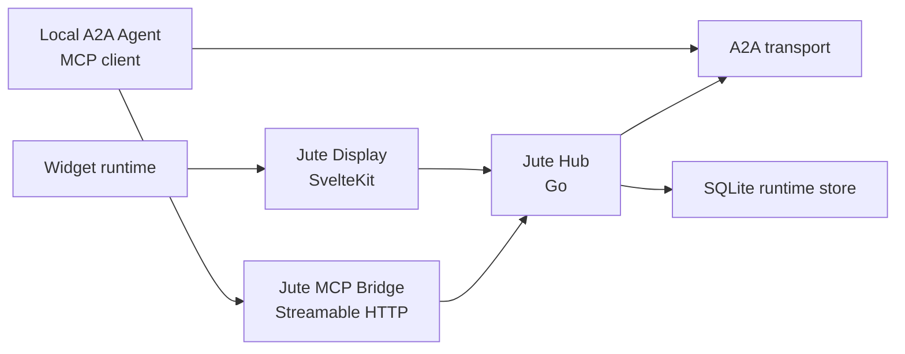

# MCP Bridge

## Goal

The Jute MCP Bridge gives local or trusted agents a richer way to understand and interact with Jute Dash.

A2A remains the conversation and task protocol. MCP is an optional tool and context surface for agents that can connect to the local hub.

The bridge exposes hub-approved dashboard context, [Widget Skills](widget-skills.md), and hub-mediated display actions. It does not expose raw widget internals, direct widget iframe access, raw adapter payloads, or credentials.

Primary references:

- [MCP documentation index](https://modelcontextprotocol.io/llms.txt)
- [MCP architecture overview](https://modelcontextprotocol.io/docs/learn/architecture)
- [MCP resources](https://modelcontextprotocol.io/specification/2025-11-25/server/resources)
- [MCP tools](https://modelcontextprotocol.io/specification/2025-11-25/server/tools)
- [MCP security best practices](https://modelcontextprotocol.io/docs/tutorials/security/security_best_practices)

## A2A And MCP Responsibilities

Jute uses both protocols for different jobs.

A2A responsibilities:

- discover and select external agents through Agent Cards;
- send user turns and voice transcripts to agents;
- receive task status, messages, and artifacts;
- carry compact dashboard context through the optional Jute A2A extension;
- remain the default path for remote or cloud agents.

MCP responsibilities:

- expose local Jute dashboard context and Widget Skills as resources;
- expose safe skill actions and Jute actions as tools;
- expose reusable hub-approved skill guidance as prompts;
- notify connected local agents when available skills, context, or tools change;
- serve local or trusted agents that can connect to the Jute hub.

If an agent does not use MCP, Jute still works through A2A. MCP is additive, not required for basic conversations.

## Runtime Placement

The MCP Bridge is part of the Go hub.

Reasons:

- the hub already owns configuration, persistence, widget permissions, agent trust, and redaction;
- the hub is the only process that should decide what dashboard context is safe to expose;
- agents should not connect directly to the Svelte display or widget iframes;
- a hub-owned bridge keeps MCP and A2A policies consistent.

Do not implement the v1 bridge as an arbitrary plugin process. Future external MCP adapters may exist, but they must call the hub through explicit APIs and must not bypass hub permissions.



## Transport And Auth

v1 default:

- transport: MCP Streamable HTTP;
- bind: `127.0.0.1`;
- default address: `127.0.0.1:8790`;
- default path: `/mcp`;
- auth mode: local bearer token by environment-variable reference;
- caller identity: pre-v1 local agents send `X-Jute-Agent-ID`;
- disabled unless explicitly enabled.

STDIO is not the default v1 path. It may be added later for CLI tools, tests, or MCP Inspector workflows, but it is awkward for a long-running hub and carries local process execution risks.

LAN exposure is off by default. If LAN exposure is enabled later, the hub must require explicit config, authentication, and clear UI warnings.

Remote internet exposure is not a v1 feature.

## Configuration

Bootstrap/import-export shape:

```yaml
mcp:
  enabled: false
  transport: streamable-http
  listen-address: 127.0.0.1:8790
  path: /mcp
  allow-lan: false
  auth:
    mode: local-token
    env-token: JUTE_MCP_TOKEN
```

Runtime settings live in SQLite. YAML is the preferred bootstrap/import/export format, and JSON remains supported for compatibility.

Current pre-v1 implementation treats MCP settings as boot-time YAML/JSON config. SQLite persistence and settings UI for MCP can follow once the bridge behavior has settled.

MCP settings classification:

- `mcp.enabled`: household durable or device-profile durable depending on deployment mode.
- `mcp.transport`: boot-only for v1.
- `mcp.listenAddress`: boot-only unless the future settings UI restarts the hub.
- `mcp.path`: boot-only for v1.
- `mcp.allowLan`: household durable, requires explicit user action.
- `mcp.auth.envToken`: secret reference.
- per-agent MCP scopes: agent install record or agent runtime settings.

Secrets remain references only. Public config may expose whether MCP is enabled and what non-secret endpoint is configured, but not the token value or token environment variable name unless in an explicit admin/debug surface.

## Per-Agent Scopes

MCP access is scoped per local agent registration.

Default read-only scopes:

- `dashboard:read`: read safe dashboard context.
- `widgets:read`: list visible widgets and read public widget context.
- `skills:read`: list available Widget Skills and read skill definitions.
- `skills:context_read`: read current public skill context.

Opt-in display scopes:

- `display:write_ephemeral`: show a temporary notification on the display.
- `display:focus_widget`: ask the display to focus or highlight a visible widget.
- `skills:action_invoke`: invoke safe Widget Skill actions through the hub.
- `skills:prompt_read`: read hub-approved Widget Skill prompt guidance.

Future approval-gated scopes:

- `home:action_request`: request a smart-home action that requires hub policy and, when appropriate, user approval.
- `voice:status_read`: read voice state without raw audio or transcripts.

Agents without a required scope receive a safe authorization error. They should degrade gracefully and continue the A2A conversation without that context or action.

Pre-v1 caller identity is intentionally simple. A local agent includes `X-Jute-Agent-ID: <configured-agent-id>` on MCP requests. The hub then applies that configured agent's scopes after the normal MCP transport/auth checks. When `auth.mode: none` is used for local dev and the header is absent, the bridge treats the caller as anonymous read-only. When token auth is enabled, scoped calls require the header. This is not a remote internet trust model; per-agent tokens can replace or strengthen it later.

## MCP Resources

The bridge exposes resources for context and skill discovery. Resource contents are generated by the hub at read time and are safe public projections.

Initial resources:

- `jute://dashboard/current`: current safe dashboard context.
- `jute://widgets/visible`: visible widget summaries.
- `jute://widgets/{id}/context`: public context for one visible widget.
- `jute://home/state`: normalized non-secret home state when granted.
- `jute://skills`: available Widget Skills for the connected agent.
- `jute://skills/{skillId}`: skill definition, visible widget instances, context schema, action summaries, and prompt summaries.
- `jute://skills/{skillId}/context`: current public context for a skill.
- `jute://widgets/{id}/skill`: mapping from a widget instance to its exposed skill.

Resource rules:

- hidden widgets are omitted;
- widget private state is omitted;
- undeclared Widget Pack fields are omitted;
- resources include freshness metadata when available;
- resource payloads use stable JSON shapes;
- the bridge validates all `jute://` URIs before reading;
- resource reads are denied when the agent lacks the required scope.

Example `jute://dashboard/current` shape:

```json
{
  "schema": "https://jute.dev/mcp/resources/dashboard-context/v1",
  "display": {
    "deviceId": "default-display",
    "profile": "default-dashboard",
    "locale": "en-GB",
    "timezone": "Europe/London",
    "interactionMode": "touch"
  },
  "dashboard": {
    "visibleWidgetIds": ["date-time", "weather", "chat-history"],
    "focusedWidgetId": "weather",
    "stale": false
  },
  "skills": [
    {
      "skillId": "jute.weather.current",
      "widgetInstanceId": "weather",
      "widgetKind": "weather",
      "displayName": "Weather",
      "summary": "Read current weather and forecast context for the configured location.",
      "context": {
        "locationName": "London",
        "condition": "Overcast",
        "temperature": 16,
        "temperatureUnit": "celsius",
        "freshness": "fresh"
      },
      "actions": ["refresh"],
      "prompts": ["weather_briefing"]
    }
  ]
}
```

## MCP Tools

The bridge exposes generic skill tools and a small number of hub-level display tools.

Initial tools:

- `jute_dashboard_context_get`: return the same safe context as `jute://dashboard/current`.
- `jute_skill_list`: list available Widget Skills.
- `jute_skill_read_context`: read current public context for a skill or widget instance.
- `jute_skill_invoke_action`: invoke a declared skill action through the hub.
- `jute_skill_prompt_get`: get hub-approved prompt guidance for a skill.
- `jute_display_notification`: show a temporary non-sensitive notification on a display.
- `jute_display_focus_widget`: focus or highlight a visible widget.

Later tools:

- approval-gated smart-home action request tools;
- voice status read tools;
- setup assistant tools for local onboarding.

Tool rules:

- tool descriptions are hub-authored only;
- Widget Pack manifest text must not become trusted MCP tool instructions;
- all tool arguments use JSON Schema;
- widget-owned operations are exposed as skill actions, not one-off MCP tools;
- display mutation tools require opt-in scopes;
- home action tools require a future approval policy;
- tools return safe user-facing errors, not raw internal errors.

## MCP Prompt

The bridge exposes one initial hub-level prompt:

- `jute_home_assistant_guidance`

The prompt explains how an agent should use Jute context and Widget Skills safely:

- inspect available resources and tools before assuming capabilities;
- prefer visible Widget Skills over hidden or guessed state;
- ask for clarification before making high-impact home changes;
- avoid mentioning private, missing, or unauthorized context;
- degrade gracefully when MCP is unavailable.

Widget Skills may also expose prompt purposes. The hub turns those declarations into stable prompt output such as `jute_skill_prompt_get` results. Third-party prompt text is not trusted until validated. Prompts are guidance, not permission grants.

## Notifications

The bridge should support MCP list/resource change notifications when available context or tools change.

Notify on:

- widget layout changes;
- widget visibility changes;
- widget permission changes;
- Widget Skill availability changes;
- agent scope changes;
- display focus changes;
- tool availability changes;
- MCP bridge degraded/offline recovery.

Connected agents should refresh resources or tools after receiving a list-changed notification.

## Widget Skills

The MCP Bridge uses the Widget Skill contract as its widget-facing capability model.

Widgets may expose skills only when:

- the widget declares `agentSkill` or is a built-in widget with an equivalent skill definition;
- the widget is visible or focused according to hub policy;
- the widget permission is granted;
- the agent has the required MCP scope.

Widget Skills can include public context, hub-approved prompts, and declared actions. Actions execute through the hub and Widget SDK; MCP clients never call widget iframes directly.

The bridge never exposes:

- hidden widgets;
- private widget state;
- raw credentials;
- raw smart-home adapter payloads;
- camera frames;
- microphone audio;
- voice pre-roll buffers;
- partial transcripts;
- browser local storage;
- undeclared Widget Pack fields.

Built-in widgets and Widget Packs use the same conceptual context rules.

Initial built-in skills:

- `jute.date_time.current`: read date, time, timezone, locale, and display format.
- `jute.weather.current`: read weather condition, temperature, humidity, wind, sunrise, sunset, and freshness.
- `jute.chat_history.current`: read available agents, selected agent, recent conversation summaries, and conversation availability.

## Security Posture

MCP is local/trusted in v1, but still a security boundary.

Rules:

- disabled by default;
- loopback bind by default;
- bearer-token auth by default;
- secrets are references only;
- no token passthrough;
- no direct widget iframe access;
- no direct display DOM access;
- no raw hub database access;
- no direct smart-home adapter access;
- no remote cloud agent receives MCP credentials automatically;
- LAN exposure requires explicit config and auth;
- public internet exposure requires a future architecture update.

MCP server resources, tools, and prompts are untrusted input from an agent's point of view. Jute's own bridge should keep descriptions stable and hub-authored to reduce tool-poisoning risk.

## Failure And Degradation

If MCP is disabled or unavailable:

- the agent continues through A2A without MCP context;
- the display may show the agent as connected through A2A but without local MCP tools;
- the hub can still send compact dashboard context through the optional A2A extension when supported;
- tool calls fail with safe authorization or unavailable errors.

If a requested widget is no longer visible, the bridge returns a safe not-found or unavailable error.

## Implementation Order

1. Document this architecture.
2. Document and implement the Widget Skill registry for built-in widgets. **Done for built-in POC widgets.**
3. Add boot-time MCP config, local token auth, and loopback Streamable HTTP transport. **Done for pre-v1.**
4. Add an MCP bridge with skill resources, skill context tools, and hub guidance prompts. **Done for the first POC slice.**
5. Add MCP-aware local A2A examples for deterministic and model-backed development loops. **Done for developer fixtures.**
6. Add low-risk display notification and widget-focus tools through hub events. **Done for the first display-action slice.**
7. Add SQLite fields for MCP settings and per-agent scopes.
8. Add future approval-gated configure and home-action tools.
