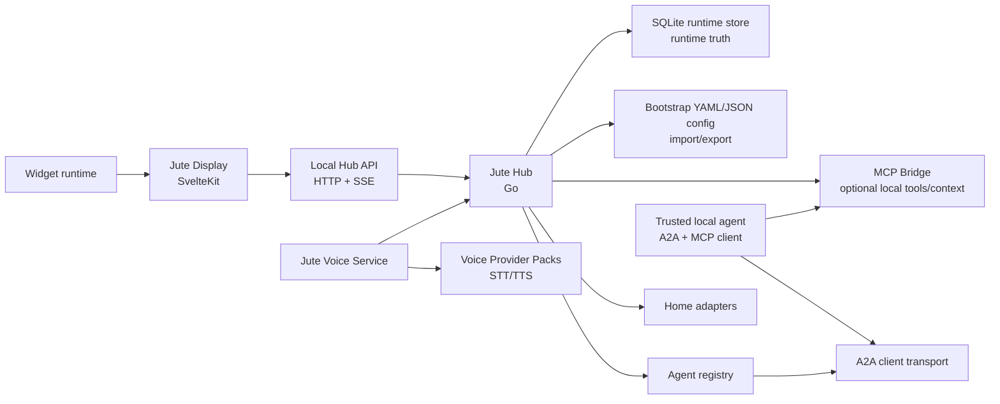

# System Architecture

## Product Shape

Jute Dash is split into two primary applications:

- **Jute Hub:** a Go service that owns configuration, persistence, local API, agent registry, A2A client transport, smart-home adapters, event streams, and future voice services.
- **Jute Display:** a SvelteKit app using shadcn-svelte conventions for the touch-first dashboard, settings UI, widget host, and kiosk/PWA experience.
- **Jute Voice Service:** a local voice boundary for microphone capture, VAD, wake-word detection, utterance buffering, STT, and optional TTS.
- **Jute MCP Bridge:** an optional hub-owned MCP surface for trusted local agents to read safe dashboard context, use Widget Skills, and call hub-mediated tools.

This split keeps the hub useful without a screen and keeps the display portable across browsers, tablets, wall displays, and native wrappers.

## Deployment Modes

- **Single-device display:** hub and display run on the same device. This is the default developer and kiosk mode.
- **Remote display:** one hub serves one or more browser/tablet displays on the local network.
- **Headless hub:** hub runs without the display for voice nodes, automations, and remote A2A routing.
- **Paired display:** display runs as a PWA or native wrapper and connects to a discovered or manually configured hub.

## Runtime Components

## Hub Responsibilities

- Load bootstrap config and merge persisted runtime settings.
- Own SQLite migrations, persistence, and import/export.
- Own first-run setup status and safe default initialization.
- Serve the local API for displays and developer tools.
- Emit state updates over Server-Sent Events first; use WebSockets later only when bidirectional low-latency transport is required.
- Resolve, cache, validate, and select A2A Agent Cards.
- Send A2A tasks and stream task updates back to displays.
- Serve the optional MCP Bridge for trusted local agents when explicitly enabled, using Widget Skills as the widget capability contract.
- Own conversation identity, follow-up windows, voice event emission, and routing final transcripts into the A2A task pipeline.
- Discover voice provider packs, validate manifests, and persist selected STT/TTS providers per device profile.
- Normalize home data from adapters into rooms, devices, scenes, sensors, and alerts.
- Enforce widget permissions, agent context policy, and redaction.

## Display Responsibilities

- Render the dashboard, ambient mode, settings, widget grid, and agent interaction surface.
- Render the voice conversation sheet, listening states, mute/cancel controls, and transcript bubbles from hub events.
- Follow the clean-slate display UX. The current `apps/web` UI is POC work, not canonical.
- Host widgets as native Svelte components inside Jute's monorepo widgets library.
- Maintain local-only transient UI state such as open menus and drag state.
- Persist durable customization by calling the hub API rather than writing browser-local storage as the source of truth.

## API Boundary

The display talks only to the hub API. It does not call remote agents or smart-home integrations directly.

Initial API families:

- `/api/v1/home`: current normalized home state.
- `/api/v1/widgets`: widget catalog, layouts, widget state, and widget permissions. The current v1 surface includes `GET /api/v1/widgets/catalog`, `GET /api/v1/widgets/layout`, `PUT /api/v1/widgets/layout`, and `POST /api/v1/widgets/layout/reset`.
- `/api/v1/agents`: configured agents, cached cards, skills, health, and selected bindings.
- `/api/v1/proxy/agents/{agentId}`: authenticated pass-through for standard A2A requests from the display. The hub selects the discovered endpoint and injects configured credentials.
- `/api/v1/setup/status`: first-run setup completeness.
- `/api/v1/status`: setup, event stream, agent, MCP, voice, and degraded health summary for safe display diagnostics.
- `/api/v1/devices`: future device profile and per-device settings.
- `/api/v1/voice/status`: current voice state, provider, mute, and follow-up status foundation.
- `/api/v1/voice/mute`, `/api/v1/voice/unmute`, `/api/v1/voice/cancel`: current voice state controls.
- `/api/v1/voice/providers`: current provider-list response shape and future STT/TTS provider pack discovery, details, and health tests.
- `/api/v1/tts`: future voice listing, preview, speak, and stop controls.
- Conversation history and typed turns currently use the A2A JavaScript SDK through the agent proxy rather than Jute-specific conversation routes.
- `/api/v1/events`: currently a minimal SSE endpoint. Future releases will use it for replayable home, widget, agent, voice, and task updates.
- `/api/v1/settings/household`: current home, display, and weather settings.
- `/api/v1/settings/rooms`: current editable room list.
- `/api/v1/settings/tiles`: current editable dashboard tile list.
- `/healthz`: existing minimal hub process reachability check.

Runtime error handling and user-facing failure states are specified in [Resilience And Error UX](resilience-error-ux.md).

The optional MCP Bridge is not part of the display API. It is a separate MCP Streamable HTTP surface for local or trusted agents, documented in [MCP Bridge](mcp-bridge.md).

## Event Stream

Use Server-Sent Events for v1 because the hub is the source of state changes and the display mostly receives updates.

Event types:

- `home.updated`
- `widget.updated`
- `widget.permission_changed`
- `settings.changed`
- `device_profile.changed`
- `agent.card_updated`
- `agent.health_changed`
- `voice.state_changed`
- `voice.wake_detected`
- `voice.provider_discovered`
- `voice.provider_health_changed`
- `voice.transcript.partial`
- `voice.transcript.final`
- `tts.started`
- `tts.chunk`
- `tts.completed`
- `tts.failed`
- `tts.stopped`
- `conversation.started`
- `conversation.turn_started`
- `conversation.turn_completed`
- `conversation.followup_started`
- `conversation.ended`
- `task.started`
- `task.status`
- `task.artifact`
- `task.completed`
- `task.failed`

Every event includes an `id`, `type`, `createdAt`, and `payload`. The display reconnects with the last seen event ID when supported.

The display treats event-stream failure as `reconnecting` or `degraded` depending on whether ordinary hub requests still work. Future reconnect events include `hub.connected`, `hub.reconnecting`, `hub.disconnected`, and `hub.degraded`. The current pre-v1 endpoint does not provide durable replay.

## Persistence

SQLite is runtime truth for household/display/widget settings. YAML config is preferred for bootstrap, import, and export. JSON config remains supported for compatibility. During the current pre-v1 agent-management slice, agent registrations are saved to the active YAML config file when one is available.

The effective configuration precedence is:

1. compiled safe defaults;
2. boot-only CLI and environment overrides;
3. optional bootstrap YAML or JSON applied only when initializing an empty runtime store;
4. SQLite household settings;
5. SQLite device profile overrides;
6. transient browser state for non-durable UI only.

Persisted data:

- device profiles and pairing records;
- dashboard layouts and theme settings;
- widget installation records, permissions, and state;
- cached Agent Cards, ETags, selected bindings, and health checks when persistent caching is enabled;
- room/device mappings and adapter metadata;
- no local conversation transcript store in the current implementation; conversation history is read from agents through A2A `ListTasks` and `GetTask`;
- voice settings, wake-word model IDs, provider pack choices, STT/TTS model IDs, TTS voice IDs, follow-up windows, cloud opt-in, command-provider enablement, sensitive-output speech policy, and microphone profiles;
- voice provider pack installation records, manifests, health state, and non-secret settings;
- MCP bridge enablement, auth references, endpoint settings, and per-agent MCP scopes;
- automation schedules when introduced.

Secrets are not stored in YAML/JSON config or ordinary SQLite settings rows. v1 uses environment variable references. Later releases add OS keyring support.

Configuration and persistence details are specified in [Configuration And Persistence](configuration-persistence.md).

## Webapp Boundary

The webapp is a client of the hub, not the authority. It can cache for responsiveness, but the hub remains the source of truth for durable settings, widget install state, agent capabilities, and home context.

Display UX details are specified in [Display UX](display-ux.md). MCP bridge details are specified in [MCP Bridge](mcp-bridge.md). Voice details are specified in [Voice And Wake Word Architecture](voice.md), [Voice Provider Packs](voice-providers.md), and [Text-To-Speech Architecture](text-to-speech.md).
