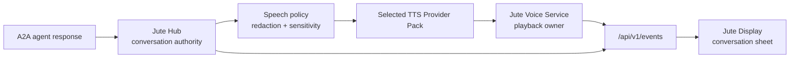
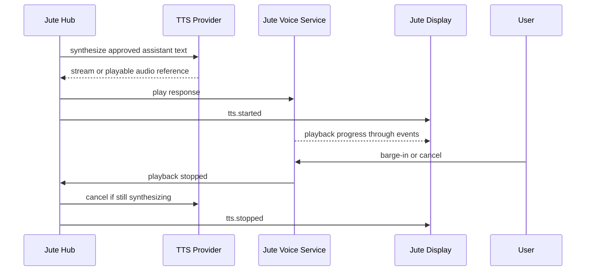

# Text-To-Speech Architecture

## Goal

Jute should speak assistant responses when a household wants that experience, but spoken output must remain optional, configurable, and local-first. The visual conversation UI remains the reliable baseline; TTS adds presence and accessibility without becoming a hard dependency.

TTS uses the same [Voice Provider Packs](voice-providers.md) model as speech-to-text. Jute does not create a separate TTS-only plugin system.

## Recommended Provider Stack

Default architecture path:

1. **Wyoming-compatible local TTS service** for local/LAN deployments and Home Assistant-compatible voice stacks.
2. **sherpa-onnx provider pack** for embedded/local TTS where Jute can call a sidecar or future built-in adapter.
3. **Piper/OHF Piper provider pack** as an external service or command wrapper. Jute should not bundle GPL TTS engines without a future licensing decision.
4. **Browser `speechSynthesis` fallback** for display-only preview or degraded mode. It is not the headless or canonical voice path.
5. **OpenAI text-to-speech provider pack** as optional cloud-quality TTS, using user-provided credentials and explicit cloud opt-in.

The first implementation should prioritize playback, cancellation, and provider health over advanced voice styling.

## Non-Canonical Fallback Decision

`htgo-tts` is **not a canonical provider path** for v1. It is MIT licensed and convenient for Go
experiments, but it is closer to a playback/helper package than a manifest-driven local neural TTS
provider. It may be revisited only as a trusted `command` or external sidecar wrapper after the
command-provider policy is enabled for a household or device profile. It must not bypass Voice
Provider Pack manifests, hub speech policy, sensitive-output handling, provider health reporting, or
the visual-first failure model.

Browser `speechSynthesis` is **supported only as a non-canonical display fallback**. It can be used
for settings voice preview or explicitly degraded display-only speech after the hub has approved the
text for speech. It is not available for headless satellites, cannot be the default household TTS
provider, and cannot speak sensitive content unless the same hub speech policy would allow a
canonical provider to speak it. Voice availability is browser/OS dependent, so settings must present
it as opportunistic rather than guaranteed.

## Component Flow

The hub decides whether a response should be spoken. The provider only synthesizes text that the hub has approved for speech.

## Playback Sequence

## Speech Policy

Before calling a TTS provider, the hub applies a speech policy.

Default policy:

- speak ordinary assistant responses;
- do not speak secrets, credentials, door codes, private calendar details, precise presence, or sensitive widget context;
- use visual-only output for sensitive responses;
- require explicit cloud opt-in before cloud TTS;
- disclose AI-generated speech where required by the selected provider policy.

Supported sensitive-output modes:

- `visual_only_sensitive`: default; render sensitive content visually but do not synthesize it.
- `ask_before_sensitive`: prompt the user before speaking sensitive content.
- `speak_all`: advanced setting only, hidden behind explicit confirmation.

## Provider Capabilities

TTS provider manifests declare:

- supported locales;
- supported voice IDs;
- voice labels;
- streaming support;
- supported formats, such as `audio/pcm`, `audio/wav`, `audio/opus`, or `audio/mpeg`;
- style or instruction support;
- speed support;
- offline status;
- network requirements;
- expected latency class;
- cache eligibility.

For low-latency local playback, prefer PCM or WAV. For network transfer, Opus or MP3 may be acceptable when supported.

## Wyoming TTS Path

The first local-first TTS provider path is Wyoming over loopback or LAN TCP. Jute sends a
`synthesize` request with hub-approved text and the selected voice/locale, then reads Wyoming
`audio-start`, `audio-chunk`, and `audio-stop` events. The adapter returns playable PCM audio bytes
with provider ID, voice ID, locale, sample rate, sample width, channel count, content type, playback
kind, and duration metadata.

Wyoming TTS health uses safe provider states:

- invalid or unsafe endpoint: `misconfigured`;
- unreachable endpoint: `offline`;
- successful local/LAN connection: `available`.

The adapter never embeds credentials in endpoints and does not upload text to cloud providers unless
cloud opt-in and a cloud provider pack are explicitly selected.

At runtime, the hub resolves the selected TTS Provider Pack from SQLite and attaches a provider only
when the manifest is a local/offline Wyoming TTS pack, the provider health is `available` or
`degraded`, required credentials are satisfied, and TTS is enabled for the device profile. Public
provider and voice-listing APIs continue to omit transport endpoints and credential metadata.
If a device profile references a voice ID that the current provider manifest no longer declares, the
hub falls back to the manifest's default voice before returning `GET /api/v1/tts/voices` metadata or
calling the active provider. Voice listing may be scoped with `deviceProfileId`; otherwise the default
display profile is used.

## API Contracts

The voice foundation persists selected TTS provider, model, voice, locale, speed, and volume beside the rest of device voice settings so playback APIs can use the same configuration surface.

Implemented foundation APIs:

- `GET /api/v1/tts/voices`: returns voices for the selected provider or a requested `providerId`,
  scoped to the default profile or requested `deviceProfileId`.
- `POST /api/v1/tts/preview`: synthesizes a short user-confirmed preview phrase.
- `POST /api/v1/tts/speak`: queues speech for approved assistant text or explicit UI action.
- `POST /api/v1/tts/stop`: stops current playback.

The preview/speak HTTP implementation applies hub speech policy, emits safe TTS state events, and returns a control response. When a selected local Wyoming or HTTP JSON provider is available, the server calls the provider synthesis path and returns safe playback metadata such as content type, sample format, duration, and audio byte count without putting raw audio bytes on the JSON or SSE surface. Without an attached provider, the same API remains a safe control/event path for UI integration tests.

`POST /api/v1/tts/stop` records `tts.stopped` as a terminal state for the active action and cancels
any in-flight provider synthesis context, including barge-in stops. If the provider returns after
that cancellation, the hub preserves the stopped state instead of converting the action to a
provider failure.

Implemented events:

- `tts.started`: synthesis or playback has begun.
- `tts.completed`: playback completed.
- `tts.failed`: synthesis or playback failed.
- `tts.stopped`: user, policy, barge-in, or timeout stopped playback.

Future events:

- `tts.chunk`: optional streaming progress event for chunked playback.

Every TTS event includes `id`, `type`, `createdAt`, `deviceId`, optional `conversationId`, optional `turnId`, and `payload`.

## UI Requirements

The conversation UI must make spoken output controllable:

- show when an assistant response is being spoken;
- keep stop and mute controls visible;
- support barge-in so user speech can stop playback and begin capture;
- show a visual response even when TTS fails;
- show selected voice and provider health in settings;
- offer preview before saving a voice;
- show clear labels for cloud providers.

Ambient mode may show only speaking/listening status. It should not reveal full sensitive text by default.

## Caching

TTS caching is optional and disabled for sensitive text.

Cache keys include:

- provider ID;
- model ID;
- voice ID;
- effective locale from the request or device profile fallback;
- normalized text hash;
- style or instruction hash;
- speed;
- output format.

Foundation cache rules:

- do not cache sensitive responses by default;
- do not cache cloud TTS output unless the user enables it;
- expose cache eligibility without writing cache files yet;
- never use raw text as a cache filename.

## Failure Behavior

TTS failure must not fail the conversation.

Failure handling:

- if synthesis fails, emit `tts.failed` and show the assistant response visually;
- if playback fails, stop audio state and keep the response visible;
- if provider health is `offline` or `misconfigured`, skip synthesis and show a setup hint in settings;
- if user cancels, stop playback and keep the conversation recoverable;
- if user barges in, stop playback and enter utterance capture or follow-up listening.

## Persisted Settings

Persist TTS settings per device profile:

- enabled;
- selected provider ID;
- selected model ID;
- selected voice ID;
- locale;
- style or instruction string when supported;
- speed;
- volume;
- streaming preference;
- output target;
- cache policy;
- sensitive-output speech policy;
- cloud opt-in.

YAML or JSON config may bootstrap these values, but runtime edits are saved through the hub settings API.

## Security And Privacy

- TTS text is household data and may include sensitive assistant output.
- Cloud TTS is opt-in and clearly labeled.
- Provider packs never receive raw credentials from manifests.
- TTS logs exclude raw synthesized text by default.
- Audio cache entries are treated as private household data.
- Browser `speechSynthesis` is only a display fallback and must not become the headless voice path.
