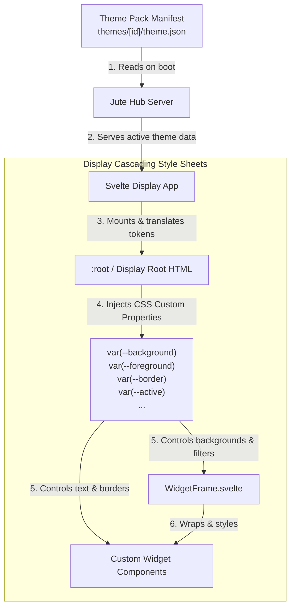

# Visual Customization

## Goal

Jute visual customization should feel like code editor themes: users choose a named theme for the whole display, and every dashboard surface, chat view, widget, sheet, and status state uses the same stable token contract.

Themes are data, not code. They can be contributed to the repo, reviewed, tested, and shipped without letting a theme change product behavior.

## Theme Pack Model

A Theme Pack is a repo-contributed manifest, planned under `themes/[theme-id]/theme.json`.

The visual customization and styling data flow follows this pipeline:



Each pack declares:

- `id`: stable lowercase identifier, such as `jute-mono`;
- `name`: user-facing name;
- `version`: semantic version for future migrations;
- `description`;
- `author`;
- `supportedModes`: `light`, `dark`, or both;
- `accessibility`: contrast level and reduced-motion support notes;
- `tokens`: color and visual tokens for the display.

Required token groups:

- `app`: background, foreground, surface, muted surface, strong surface, border, strong border, shadow, focus;
- `text`: primary, secondary, muted, inverse;
- `semantic`: danger, warning, success, active, info;
- `chat`: user bubble, assistant bubble, system row, streaming indicator;
- `widget`: frame background, frame border, title, chrome variants;
- `overlay`: sheet background, modal background, scrim, smoked overlay, frosted overlay.

Themes must not define layout, widget capability, agent context, permissions, API behavior, routes, or executable code.

## Default Theme

The built-in default theme is `jute-mono`.

It preserves the current v1 visual direction:

- light mode: black-on-white;
- dark mode: white-on-black;
- neutral gray borders and surfaces;
- semantic colors only for state, such as error, warning, success, active voice, and recording.

## Included Themes

The first bundled Theme Packs are:

- `jute-mono`: the default BOW/WOB Jute palette;
- `solarized`: Solarized-inspired light and dark modes;
- `ayu`: Ayu-inspired warm light and dark modes;
- `one-dark`: One Dark-inspired dark mode with a One Light-style companion;
- `gruvbox`: Gruvbox-inspired warm light and dark modes;
- `dracula`: Dracula-inspired dark mode with a practical light companion.
- `catppuccin`: Catppuccin-inspired soft pastel light and dark modes;
- `nord`: Nord-inspired cool blue-gray light and dark modes;
- `tokyo-night`: Tokyo Night-inspired modern blue-purple light and dark modes;
- `kanagawa`: Kanagawa-inspired warm light and dark modes;
- `monokai`: Monokai-inspired high-contrast light and dark modes;
- `material`: Material/Oceanic-inspired teal-blue light and dark modes;
- `github`: GitHub-inspired practical light and dark modes;
- `everforest`: Everforest-inspired soft green and warm neutral light and dark modes.

These themes are repo data under `themes/[theme-id]/`. The Svelte display reads the bundled Theme Pack JSON files and converts their mode tokens into Display CSS custom properties, falling back to `jute-mono` for unknown themes, missing modes, or missing tokens.

## Display Configuration

The future display config should separate color mode from theme identity.

```yaml
display:
  color-mode: system
  theme-id: jute-mono
  density: comfortable
  motion: full
  background:
    kind: theme
  widget-chrome:
    default: solid
```

Fields:

- `color-mode`: `system`, `light`, or `dark`;
- `theme-id`: selected Theme Pack ID, currently `jute-mono`, `solarized`, `ayu`, `one-dark`, `gruvbox`, `dracula`, `catppuccin`, `nord`, `tokyo-night`, `kanagawa`, `monokai`, `material`, `github`, or `everforest`;
- `density`: `comfortable`, `compact`, or `large-touch`;
- `motion`: `full`, `reduced`, or `none`;
- `background`: display background source and rendering policy;
- `widget-chrome.default`: default surface treatment for widgets.

The current `display.theme` field is a pre-v1 compatibility field and should eventually become `display.colorMode`.

## Backgrounds

Background images are local-first in v1.

Supported sources:

- `theme`: use the Theme Pack default background;
- `color`: use a configured solid color token or literal color value after validation;
- `asset`: use a packaged display asset, such as `/backgrounds/kitchen-mono.jpg`;
- `file`: use a single file under the hub-managed backgrounds directory;
- `slideshow`: cycle through a list of files under the hub-managed backgrounds directory;
- `dynamic`: render a dynamically compiled Svelte background (e.g. `weather-ambient` or `stardust`) with custom runtime property inputs.

Remote image URLs are out of scope for v1. They create privacy, availability, CSP, and mixed-content risks that need a separate remote media policy.

### Image library and upload

Background images are managed locally by the hub:

- the hub exposes endpoints to upload an image into the managed backgrounds directory, list the library, and delete an image;
- uploads are validated for image type and size and are stored as local media assets under the hub data directory — never in YAML/JSON config or public API responses;
- the `Appearance` settings section lets the user upload images, browse the library, and choose a single image or build a slideshow set;
- only a reference (file id/path) is stored in durable display settings; the binary stays a local media asset.

### Slideshow

When `kind` is `slideshow`, the background config additionally carries:

- an ordered list of image references to cycle;
- `intervalSeconds`: dwell time per image;
- a transition (crossfade) that respects the display `motion` setting (no animation under reduced motion).

The slideshow is cycled client-side by the display; the hub stores only the references and timing.

Background rendering options:

- `fit`: `cover`, `contain`, or `tile`;
- `position`: CSS-like safe keywords, such as `center`, `top`, `bottom`, `left`, `right`;
- `overlay`: `none`, `dim`, `smoked`, or `frosted`.

Example:

```yaml
display:
  color-mode: dark
  theme-id: jute-mono
  background:
    kind: asset
    value: /backgrounds/kitchen-wall.jpg
    fit: cover
    position: center
    overlay: smoked
  widget-chrome:
    default: smoked
```

## Widget Chrome

Widget chrome controls how a widget frame sits on top of the display background.

Supported values:

- `solid`: opaque theme surface;
- `clear`: transparent body with visible border;
- `smoked`: translucent surface over backgrounds;
- `frosted`: smoked surface plus blur where supported;
- `auto`: theme chooses based on background and color mode.

The global default lives in `display.widget-chrome.default`.

Per-widget overrides live in widget settings:

```yaml
dashboard:
  widgets:
    - id: weather
      type: weather
      title: Weather
      x: 2
      y: 0
      w: 2
      h: 1
      visible: true
      settings:
        chrome: clear
```

Widget authors may declare preferred or unsupported chrome modes in their widget documentation. The host still owns final rendering, and all widgets must remain legible in `solid` and `smoked`.

## Token Application

The display app applies Theme Packs by converting `themes/[theme-id]/theme.json` mode tokens into CSS custom properties at the display root.

Rules:

- all components consume stable CSS variables, not hard-coded theme IDs;
- Theme Pack JSON is the Display token source; duplicated hard-coded token registries are avoided;
- `WidgetFrame` owns widget chrome classes and background blending;
- chat, settings, modals, banners, and widget frames share the same token source;
- reduced motion and high contrast are applied globally before widget-specific styling;
- unsupported or missing theme tokens fall back to `jute-mono`.

## Persistence

Theme selection, background policy, widget chrome defaults, and per-widget chrome overrides are durable settings owned by the hub.

Storage classification:

- Theme Pack manifests are install records.
- Theme selection is household or device-profile durable, depending on scope.
- Background image references are durable settings.
- Background image binary files are local media assets under the hub data directory.
- Per-widget chrome overrides are widget settings.

YAML config may bootstrap these settings for an empty store and can represent them in import/export. Browser storage is not a durable theme source.

## Contribution Rules

Theme contributions must include:

- `theme.json`;
- light and/or dark token definitions matching `supportedModes`;
- screenshots or documented visual smoke results for dashboard, settings, chat, and widgets;
- contrast notes for primary text, secondary text, widget frames, buttons, and focus rings;
- reduced-motion notes if the theme uses animations or blur.

Themes must:

- preserve readable text over every supported widget chrome mode;
- keep focus rings visible;
- avoid relying on color alone for status;
- avoid remote assets;
- avoid theme text that becomes prompt/tool instructions for agents.

## Security And Privacy

Theme Packs and backgrounds are untrusted data until validated.

Rules:

- no JavaScript, HTML, SVG scripts, remote imports, or executable hooks in Theme Packs;
- no raw credentials, household secrets, or agent instructions in theme metadata;
- no remote background URLs in v1;
- local file backgrounds must stay inside the hub-managed backgrounds directory;
- theme metadata is display copy only and must not become A2A or MCP tool instructions.

## Rollout

Implementation should happen in three slices:

1. Add config structs, examples, validation, and public config projection for `themeId`, `colorMode`, backgrounds, and widget chrome.
2. Add a `themes/` directory with `jute-mono`, token loading, CSS variable application, and `WidgetFrame` chrome variants.
3. Add settings UI for theme selection, background selection, and widget chrome overrides.
