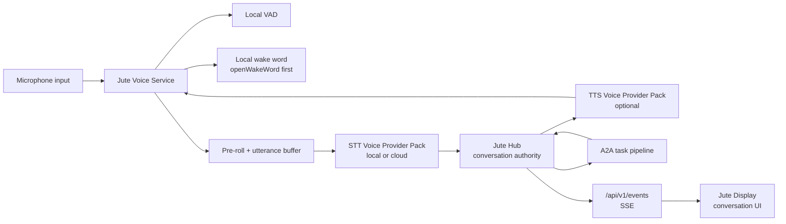
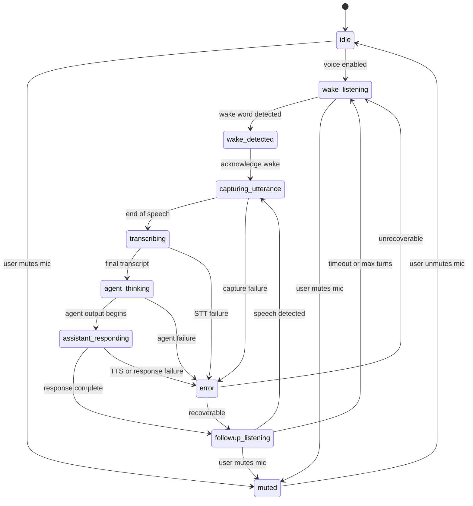
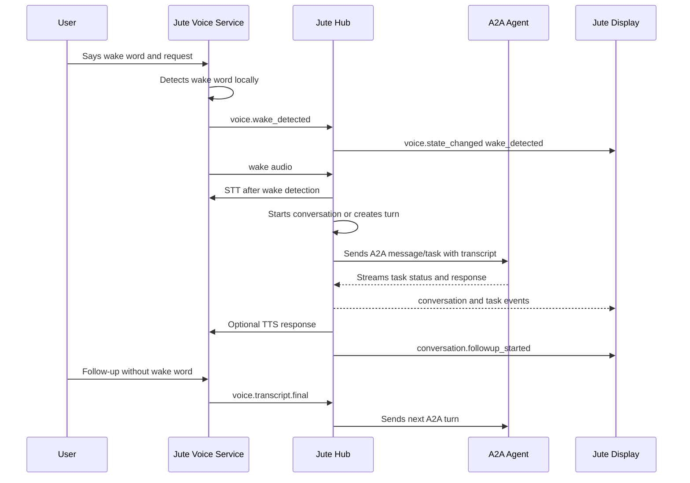

# Voice And Wake Word Architecture

## Goal

Jute voice should feel natural on an always-on home display without weakening the local-first architecture. The first implementation target is a hub-owned runtime on the dashboard or kiosk device with a microphone and visible conversation UI.

The chosen posture is **local-first hybrid**:

- wake word detection runs locally before any cloud service is used;
- voice activity detection runs locally;
- speech-to-text and text-to-speech are provider interfaces with local and optional cloud implementations;
- the Go hub remains the conversation authority;
- A2A agents receive transcripts and redacted context, not raw microphone audio.

Canonical voice runtime is inside the Go hub. The Svelte display may act as a browser microphone
client by sending PCM to the hub, but browser STT, browser wake-word decisions, browser-side speech
synthesis, and direct A2A routing are out of scope for v1.

## Ecosystem References

- [openWakeWord](https://github.com/dscripka/openWakeWord): first local wake-word baseline.
- [Home Assistant wake-word architecture](https://www.home-assistant.io/voice_control/about_wake_word/): useful prior art for local wake detection.
- [sherpa-onnx](https://k2-fsa.github.io/sherpa/onnx/): local/offline speech toolkit with ASR, VAD, and TTS paths.
- [OpenAI speech-to-text](https://developers.openai.com/api/docs/guides/speech-to-text): optional cloud STT provider for higher transcription quality.
- [OpenAI text-to-speech](https://developers.openai.com/api/docs/guides/text-to-speech): optional cloud TTS provider.
- [OHF Piper](https://github.com/OHF-Voice/piper1-gpl): local TTS reference for external service or command-provider integration.

## Component Architecture

## Jute Voice Service

The Jute Voice Service is a hub module. The hub owns wake word, STT, TTS, settings, state, and events.

Responsibilities:

- capture microphone audio;
- apply local voice activity detection;
- run local wake-word detection;
- maintain a short pre-roll buffer so the beginning of speech is not lost;
- capture one utterance at a time;
- call the selected STT provider;
- optionally call the selected TTS provider for spoken responses;
- report state, partial transcripts, and final transcripts to the hub.

The voice service does not call A2A agents directly. It sends transcripts and state to the hub, and the hub decides whether to start or continue a conversation.

The foundation service loop is driver-neutral. It accepts a pluggable PCM `AudioCapture`, runs a
pluggable local VAD over fixture or device frames, maintains a time-windowed pre-roll buffer, emits
safe state updates, and returns captured utterance frames to the next local provider step. Platform
microphone drivers are added behind the capture interface; tests use synthetic PCM fixtures so CI
does not require a microphone.

Service state and health:

- disabled devices remain `idle`;
- muted devices remain `muted` and stop active capture;
- enabled and unmuted devices enter `wake_listening`;
- local VAD speech transitions to `capturing_utterance`;
- capture failures transition to `error` with a safe service status and sanitized message;
- cancel stops active capture and returns to the configured resting state.

The service never logs raw PCM. Pre-roll and utterance frames stay in memory until a selected STT
provider receives them through an explicit local provider call.

## Hub Conversation Authority

The Go hub owns conversation identity, turn ordering, agent selection, follow-up windows, and event emission.

Hub responsibilities:

- start a conversation after wake-word activation or push-to-talk;
- continue an existing conversation during the follow-up window;
- send user turns through the same A2A message/task pipeline as typed messages;
- attach redacted dashboard context when the target agent supports it;
- emit voice, conversation, and task events over `/api/v1/events`;
- persist conversation summaries when history is enabled;
- enforce mute, cancel, timeout, and privacy policy.

## Voice State Machine

State definitions:

- `muted`: microphone is disabled by user or policy.
- `idle`: voice feature is inactive or not yet configured.
- `wake_listening`: local wake-word engine is active.
- `wake_detected`: wake word fired and acknowledgement begins.
- `capturing_utterance`: user speech is being recorded.
- `transcribing`: STT provider is producing a transcript.
- `agent_thinking`: hub has sent the turn to an A2A agent.
- `assistant_responding`: response is being displayed or spoken.
- `followup_listening`: user can continue without wake word.
- `error`: recoverable or terminal voice failure state.

## Wake And Follow-Up Flow

Implemented command-capture wake flow:

1. Device continuously listens locally for the configured wake word while unmuted.
2. On wake, Jute plays or displays an acknowledgement state.
3. The hub runs STT against the same utterance, strips the wake phrase, and keeps the chat open if no command remains.
4. STT produces a transcript.
5. The hub creates or continues a conversation and forwards the sanitized transcript to the selected A2A agent.

Follow-up flow:

1. After an assistant response completes, the hub enters `followup_listening`.
2. Default follow-up window is 8 seconds.
3. During this window, user speech starts a new turn without the wake word.
4. Each valid follow-up resets the 8-second window.
5. Maximum continuous follow-up session is 45 seconds or 5 turns, whichever comes first.
6. Manual cancel, timeout, mute, or long silence returns to `wake_listening`.

Error flow:

- Failed wake detection stays silent unless debug mode is enabled.
- Failed STT shows "I didn't catch that" and briefly returns to follow-up listening.
- Failed agent response shows a recoverable conversation error and exits follow-up.

## Provider Strategy

STT and TTS integrations use [Voice Provider Packs](voice-providers.md). Provider packs are selectable, manifest-driven integrations owned by the hub runtime. They are not Go in-process dynamic plugins and they do not require extra long-running server daemons for the default path.

Wake-word providers default to hub-owned `command` adapters. The hub captures audio, writes a
temporary WAV when needed, invokes the selected local provider command, emits
`voice.wake_detected` on detection, and then continues to STT. microWakeWord remains deferred until
its native dependency chain is worth carrying.

STT providers default to trusted hub-owned command adapters, with faster-whisper-style local CLIs as the
first practical path. Command providers are disabled until explicitly enabled, must use absolute
commands, receive a temporary WAV path through `{inputPath}`, and return final transcript JSON.
Cloud upload still requires explicit opt-in.

Captured utterances flow through a hub-owned STT turn processor: the local voice service hands off a
cloned utterance, the selected provider returns transcript metadata, and only the sanitized final
transcript is submitted through the same server-owned final transcript sink used by
`/api/v1/voice/transcripts/final`. Provider connection details and raw audio stay out of the
submitted transcript payload. The hub starts the local voice service when voice is enabled, unmuted,
and `voice.capture-command` is configured. The capture command is a hub-owned local process that
streams signed 16-bit little-endian mono PCM to stdout; the hub frames it, runs VAD, then passes the
utterance through wake/STT. If STT processing fails, the hub emits a safe degraded
`voice.state_changed` error state and does not create an A2A turn.

For display/browser microphone input, the display only captures PCM after browser permission is
granted. Push-to-talk posts an utterance to `POST /api/v1/voice/audio`; passive dashboard wake
listening posts speech candidates to `POST /api/v1/voice/audio?wake=true`. The hub validates PCM,
runs VAD, applies the selected wake provider when `wake=true`, runs the selected STT provider only
after wake detection, then strips the configured wake phrase and submits the sanitized final
transcript through the same A2A text path. Browser `SpeechRecognition` and browser wake models
remain out of scope. Browser TTS playback uses hub-synthesized audio from
`/api/v1/tts/audio/{id}`; the browser does not synthesize speech itself.

TTS providers:

- optional in v1;
- default path: hub-owned command local TTS adapters;
- embedded/local candidate: sherpa-onnx TTS through a provider pack;
- Piper/OHF Piper should be a command-provider integration unless a future licensing decision changes this;
- optional cloud providers such as OpenAI text-to-speech require explicit opt-in;
- the visual conversation UI must remain fully useful when TTS is disabled.

The provider interfaces should support health status, model name, language, latency metrics, and last error state.

TTS-specific playback, caching, and speech policy details are specified in [Text-To-Speech Architecture](text-to-speech.md).

## Foundation Implementation Slices

The first voice implementation creates durable voice settings, safe hub status/control APIs, display mute/listening status, event emission, command-provider wake/STT/TTS resolution, and the hub-owned final-transcript-to-A2A handoff. The visual conversation remains the reliable baseline when provider resolution or synthesis/transcription fails.

Implemented v1 foundation APIs:

- `GET /api/v1/voice/status`: returns enabled/muted state, selected provider IDs, follow-up window, device profile, and safe service status.
- `GET /api/v1/voice/providers`: returns discovered provider pack summaries; this may be an empty list before provider discovery exists.
- `PATCH /api/v1/voice/settings`: updates durable device-profile voice settings through the hub, including enablement, wake/STT/TTS provider selections, wake sensitivity, locale, follow-up window, cloud opt-in, command-provider enablement, microphone profile, and sensitive-output policy. Unknown fields are rejected and raw secret values are never accepted or returned.
- `POST /api/v1/voice/mute`: marks the device voice state muted.
- `POST /api/v1/voice/unmute`: marks the device voice state unmuted.
- `POST /api/v1/voice/cancel`: clears transient voice activity when present and returns the current safe status.
- `POST /api/v1/voice/transcripts/final`: accepts final text from the local voice service, starts or continues a hub-owned voice conversation, dispatches the text through the configured A2A agent runner, emits ordered voice/conversation events, and returns the conversation detail plus follow-up deadline.

Implemented local voice-service foundation:

- pluggable PCM capture interface for hub-owned microphone drivers;
- pluggable VAD interface with fixture-audio tests;
- configurable pre-roll and silence windows;
- in-memory captured utterance handoff for the selected STT provider path;
- STT turn processing from cloned captured utterance to sanitized final transcript submission;
- server-side local voice service construction from capture/VAD interfaces plus active STT provider;
- safe state transitions for `idle`, `muted`, `wake_listening`, `capturing_utterance`, and `error`;
- cancel and mute controls that stop active capture without logging raw audio.

Foundation state names are `muted`, `idle`, `wake_listening`, `capturing_utterance`, and `error`. The service status is `not_configured` until voice is enabled and an STT provider is selected. The display may show microphone controls and voice settings from this state, but browser microphone capture is still out of scope.

## API Contracts

Hub APIs:

- `GET /api/v1/voice/status`: returns current state, mute status, selected provider IDs, and follow-up settings. Future status payloads may include active conversation ID and follow-up deadline.
- `GET /api/v1/voice/providers`: returns discovered STT/TTS provider packs and health states.
- `PATCH /api/v1/voice/settings`: persists safe device-profile voice settings in SQLite. The request may include `deviceProfileId`, enablement, wake-word model or phrase, wake sensitivity, STT/TTS provider and model IDs, TTS voice/locale/speed/volume, preferred agent ID, cloud opt-in, command-provider enablement, sensitive-output policy, follow-up window seconds, and microphone profile. The hub validates bounds, rejects unknown fields, and emits `voice.state_changed` with a redacted state summary after a successful save.
- `POST /api/v1/voice/mute`: mutes microphone capture.
- `POST /api/v1/voice/unmute`: unmutes microphone capture.
- `POST /api/v1/voice/cancel`: cancels active capture, transcription, response, or follow-up session.
- `POST /api/v1/voice/transcripts/final`: hub-owned voice-service ingress for final transcripts. The request accepts `text`, optional `deviceProfileId`, optional `deviceId`, optional `conversationId`, and optional `agentId`. Unknown fields are rejected so raw audio, pre-roll buffers, and provider internals cannot slip through this API.

Future hub APIs:

- `GET /api/v1/voice/providers/{id}`: returns provider details, capabilities, and setup status.
- `POST /api/v1/voice/providers/{id}/test`: future safe provider health test surface.

Typed display chat currently uses the standard A2A JavaScript SDK through `/api/v1/proxy/agents/{agentId}`. Voice remains hub-owned because the hub must enforce wake-word, privacy, follow-up-window, and routing policy before sending final transcripts to agents.

## Event Contracts

Voice and conversation events are emitted over `/api/v1/events`:

- `voice.state_changed`
- `voice.wake_detected`
- `voice.provider_discovered`
- `voice.provider_health_changed`
- `voice.transcript.partial`
- `voice.transcript.final`
- `conversation.started`
- `conversation.turn_started`
- `conversation.turn_completed`
- `conversation.followup_started`
- `conversation.ended`

Every event includes `id`, `type`, `createdAt`, `deviceId`, optional `conversationId`, and `payload`.

## Conversation UI

The display chat experience is specified in [Display UX](display-ux.md). Voice uses the same chat mode primitives for listening, thinking, streaming, error, mute, cancel, and follow-up states.

The display should use an Echo Show-style conversation flow that transitions from the dashboard into focused chat mode.

UI requirements:

- reuse the display chat surface on every layout;
- visually mark `wake_detected`, `capturing_utterance`, and `followup_listening`;
- transcript bubbles for user and assistant turns;
- compact task progress states while the agent is thinking;
- always-visible mute and cancel controls while voice is active;
- clear visual distinction between wake listening and follow-up listening;

The conversation UI consumes hub events. It should not infer conversation state only from local browser state.

The display settings UI also renders the safe voice settings projection served by the hub. It may let users enable or disable voice for the selected device profile, pick wake/STT/TTS providers and voices, adjust wake sensitivity and follow-up timing within hub-defined bounds, opt in to cloud providers, and use mute/cancel controls. It must label cloud providers clearly, show setup status or hints instead of credential values, and save durable changes through `PATCH /api/v1/voice/settings` rather than browser-local durable storage.

## Persisted Settings

Persist these settings per device profile in SQLite:

- wake word phrase or model ID;
- wake sensitivity threshold;
- voice service provider;
- STT provider pack;
- TTS provider pack;
- STT/TTS model IDs;
- TTS voice ID;
- cloud STT/TTS opt-in;
- command-provider enablement;
- sensitive-output speech policy;
- follow-up window seconds, default `8`;
- maximum follow-up session seconds, default `45`;
- maximum follow-up turns, default `5`;
- mute default;
- microphone profile;
- preferred voice language;
- per-device preferred agent.

YAML or JSON config may bootstrap these values, but runtime changes are saved through the hub settings API.

## Privacy Rules

- Raw microphone audio stays local by default.
- Wake-word and VAD processing happen before any cloud provider is called.
- Cloud STT and cloud TTS are opt-in per household or device profile.
- A2A agents receive final transcripts and redacted dashboard context only.
- Raw audio, pre-roll buffers, and partial transcripts are not sent to A2A agents.
- Voice Provider Pack manifests never contain raw secrets.
- Voice logs exclude raw audio and raw transcripts by default.
- Ambient mode avoids showing transcripts unless the user has enabled visible conversation history.
