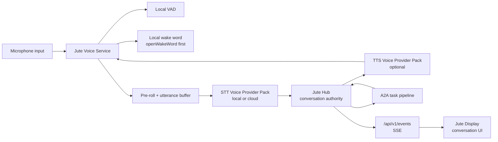
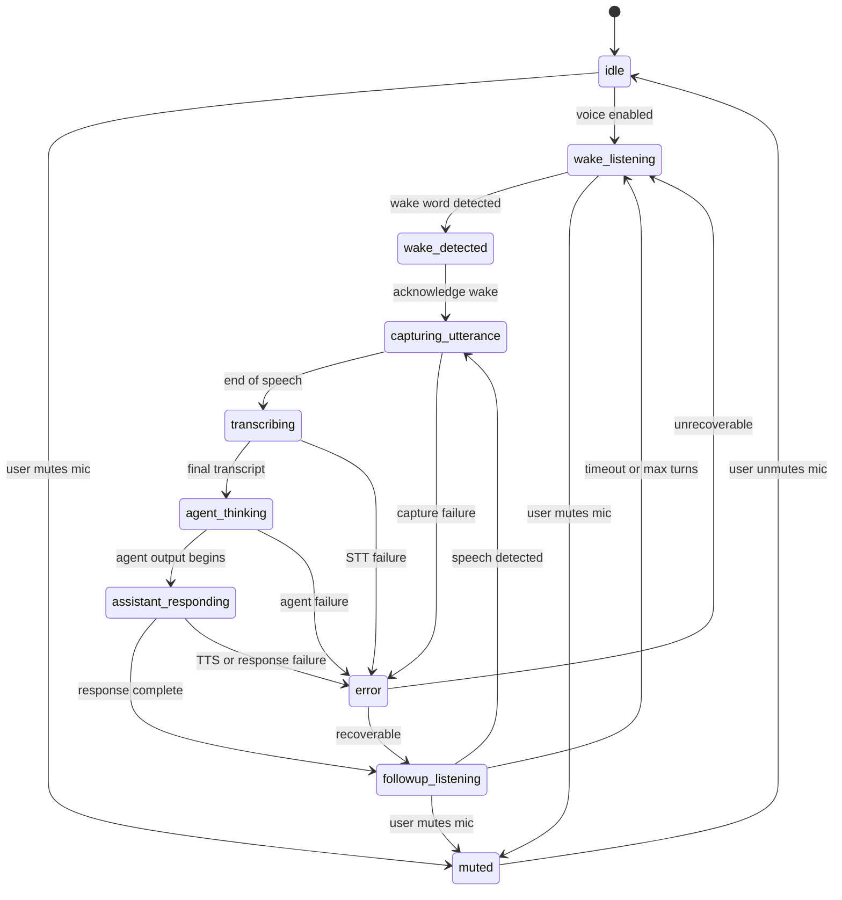
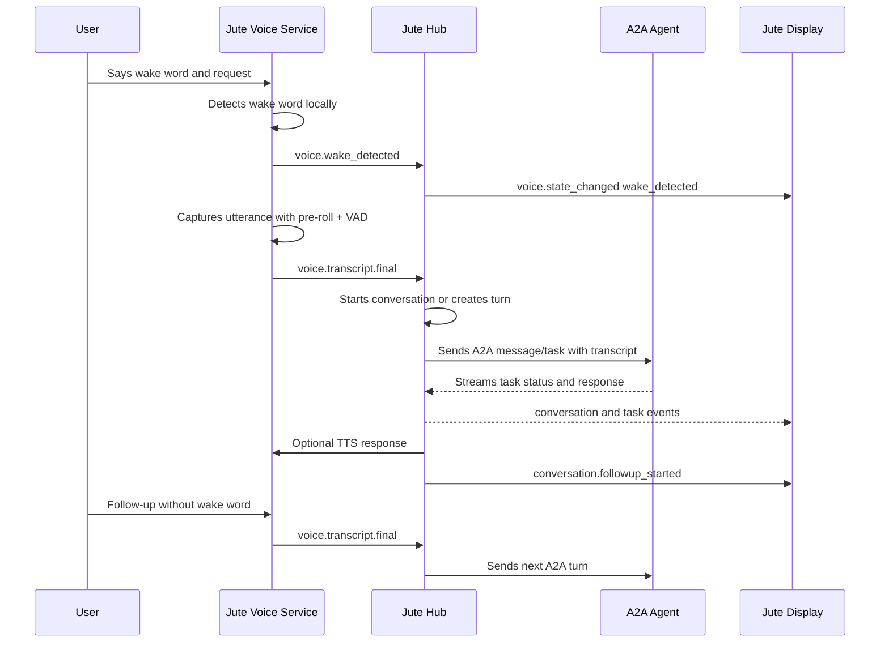

# Voice And Wake Word Architecture

## Goal

Jute voice should feel natural on an always-on home display without weakening the local-first architecture. The first implementation target is a dashboard or kiosk device with a microphone and visible conversation UI. The same design must also support later headless voice satellites on Raspberry Pi-style hardware.

The chosen posture is **local-first hybrid**:

- wake word detection runs locally before any cloud service is used;
- voice activity detection runs locally;
- speech-to-text and text-to-speech are provider interfaces with local and optional cloud implementations;
- the Go hub remains the conversation authority;
- A2A agents receive transcripts and redacted context, not raw microphone audio.

## Ecosystem References

- [openWakeWord](https://github.com/dscripka/openWakeWord): first local wake-word baseline.
- [Home Assistant wake-word architecture](https://www.home-assistant.io/voice_control/about_wake_word/): useful model for server-side wake detection and voice satellites.
- [Wyoming Protocol](https://www.home-assistant.io/integrations/wyoming): integration-compatible local voice service boundary for wake word, STT, and TTS systems.
- [sherpa-onnx](https://k2-fsa.github.io/sherpa/onnx/): local/offline speech toolkit with ASR, VAD, and TTS paths.
- [OpenAI speech-to-text](https://developers.openai.com/api/docs/guides/speech-to-text): optional cloud STT provider for higher transcription quality.
- [OpenAI text-to-speech](https://developers.openai.com/api/docs/guides/text-to-speech): optional cloud TTS provider.
- [OHF Piper](https://github.com/OHF-Voice/piper1-gpl): local TTS reference for external service or command-provider integration.

## Component Architecture

## Jute Voice Service

The Jute Voice Service is a local process or module that runs beside the Go hub on display devices. Later it can run on headless satellite devices and connect back to the hub.

Responsibilities:

- capture microphone audio;
- apply local voice activity detection;
- run local wake-word detection;
- maintain a short pre-roll buffer so the beginning of speech is not lost;
- capture one utterance at a time;
- call the selected STT provider;
- optionally call the selected TTS provider for spoken responses;
- report state, partial transcripts, and final transcripts to the hub.

The voice service does not call A2A agents directly. It sends transcripts and state to the hub, and the hub decides whether to start or continue a conversation.

## Hub Conversation Authority

The Go hub owns conversation identity, turn ordering, agent selection, follow-up windows, and event emission.

Hub responsibilities:

- start a conversation after wake-word activation or push-to-talk;
- continue an existing conversation during the follow-up window;
- send user turns through the same A2A message/task pipeline as typed messages;
- attach redacted dashboard context when the target agent supports it;
- emit voice, conversation, and task events over `/api/v1/events`;
- persist conversation summaries when history is enabled;
- enforce mute, cancel, timeout, and privacy policy.

## Voice State Machine

State definitions:

- `muted`: microphone is disabled by user or policy.
- `idle`: voice feature is inactive or not yet configured.
- `wake_listening`: local wake-word engine is active.
- `wake_detected`: wake word fired and acknowledgement begins.
- `capturing_utterance`: user speech is being recorded.
- `transcribing`: STT provider is producing a transcript.
- `agent_thinking`: hub has sent the turn to an A2A agent.
- `assistant_responding`: response is being displayed or spoken.
- `followup_listening`: user can continue without wake word.
- `error`: recoverable or terminal voice failure state.

## Wake And Follow-Up Flow

Wake flow:

1. Device continuously listens locally for the configured wake word while unmuted.
2. On wake, Jute plays or displays an acknowledgement state.
3. Jute captures the utterance using VAD and a short pre-roll buffer.
4. STT produces a transcript.
5. The voice service sends the transcript to the hub.
6. The hub creates or continues a conversation and forwards the turn to the selected A2A agent.

Follow-up flow:

1. After an assistant response completes, the hub enters `followup_listening`.
2. Default follow-up window is 8 seconds.
3. During this window, user speech starts a new turn without the wake word.
4. Each valid follow-up resets the 8-second window.
5. Maximum continuous follow-up session is 45 seconds or 5 turns, whichever comes first.
6. Manual cancel, timeout, mute, or long silence returns to `wake_listening`.

Error flow:

- Failed wake detection stays silent unless debug mode is enabled.
- Failed STT shows "I didn't catch that" and briefly returns to follow-up listening.
- Failed agent response shows a recoverable conversation error and exits follow-up.

## Provider Strategy

STT and TTS integrations use [Voice Provider Packs](voice-providers.md). Provider packs are selectable, manifest-driven integrations that run through process or network boundaries. They are not Go in-process dynamic plugins.

Wake-word providers:

- default: openWakeWord;
- later: Porcupine, microWakeWord, and Wyoming-compatible engines.

STT providers:

- default path: Wyoming-compatible local/LAN STT services;
- local/offline candidates: sherpa-onnx ASR and Whisper-compatible sidecars;
- optional cloud providers such as OpenAI speech-to-text for higher accuracy;
- cloud upload requires explicit household or device profile opt-in.

TTS providers:

- optional in v1;
- default path: Wyoming-compatible local/LAN TTS services;
- embedded/local candidate: sherpa-onnx TTS through a provider pack;
- Piper/OHF Piper should be external service or command-provider integration unless a future licensing decision changes this;
- optional cloud providers such as OpenAI text-to-speech require explicit opt-in;
- the visual conversation UI must remain fully useful when TTS is disabled.

The provider interfaces should support health status, model name, language, latency metrics, and last error state.

TTS-specific playback, caching, and speech policy details are specified in [Text-To-Speech Architecture](text-to-speech.md).

## API Contracts

Future hub APIs:

- `GET /api/v1/voice/status`: returns current state, mute status, selected providers, active conversation ID, and follow-up deadline.
- `GET /api/v1/voice/providers`: returns discovered STT/TTS provider packs and health states.
- `GET /api/v1/voice/providers/{id}`: returns provider details, capabilities, and setup status.
- `POST /api/v1/voice/providers/{id}/test`: runs a safe provider health or preview test.
- `POST /api/v1/voice/mute`: mutes microphone capture.
- `POST /api/v1/voice/unmute`: unmutes microphone capture.
- `POST /api/v1/voice/cancel`: cancels active capture, transcription, response, or follow-up session.
- `POST /api/v1/conversations`: starts a typed, push-to-talk, or wake-word conversation.
- `POST /api/v1/conversations/{id}/turns`: appends a user turn to an existing conversation.
- `PATCH /api/v1/devices/{id}/voice-settings`: updates selected providers and per-device voice settings.

The existing `POST /api/v1/messages` endpoint remains a starter contract. Conversation APIs become the durable interface once multi-turn state exists.

## Event Contracts

Voice and conversation events are emitted over `/api/v1/events`:

- `voice.state_changed`
- `voice.wake_detected`
- `voice.provider_discovered`
- `voice.provider_health_changed`
- `voice.transcript.partial`
- `voice.transcript.final`
- `conversation.started`
- `conversation.turn_started`
- `conversation.turn_completed`
- `conversation.followup_started`
- `conversation.ended`

Every event includes `id`, `type`, `createdAt`, `deviceId`, optional `conversationId`, and `payload`.

## Conversation UI

The display chat experience is specified in [Display UX](display-ux.md). Voice uses the same chat mode primitives for listening, thinking, streaming, error, mute, cancel, and follow-up states.

The display should use an Echo Show-style conversation flow that transitions from the dashboard into focused chat mode.

UI requirements:

- bottom sheet on wide and tablet layouts;
- side sheet on large wall displays when it leaves widgets more visible;
- large listening orb or ring for `wake_detected`, `capturing_utterance`, and `followup_listening`;
- transcript bubbles for user and assistant turns;
- compact task progress states while the agent is thinking;
- always-visible mute and cancel controls while voice is active;
- clear visual distinction between wake listening and follow-up listening;
- ambient mode shows only listening/responding status by default, not full transcripts.

The conversation UI consumes hub events. It should not infer conversation state only from local browser state.

## Persisted Settings

Persist these settings per device profile in SQLite:

- wake word phrase or model ID;
- voice service provider;
- STT provider pack;
- TTS provider pack;
- STT/TTS model IDs;
- TTS voice ID;
- cloud STT/TTS opt-in;
- command-provider enablement;
- sensitive-output speech policy;
- follow-up window seconds, default `8`;
- maximum follow-up session seconds, default `45`;
- maximum follow-up turns, default `5`;
- mute default;
- microphone profile;
- preferred voice language;
- per-device preferred agent.

JSON config may bootstrap these values, but runtime changes are saved through the hub settings API.

## Privacy Rules

- Raw microphone audio stays local by default.
- Wake-word and VAD processing happen before any cloud provider is called.
- Cloud STT and cloud TTS are opt-in per household or device profile.
- A2A agents receive final transcripts and redacted dashboard context only.
- Raw audio, pre-roll buffers, and partial transcripts are not sent to A2A agents.
- Voice Provider Pack manifests never contain raw secrets.
- Voice logs exclude raw audio and raw transcripts by default.
- Ambient mode avoids showing transcripts unless the user has enabled visible conversation history.
