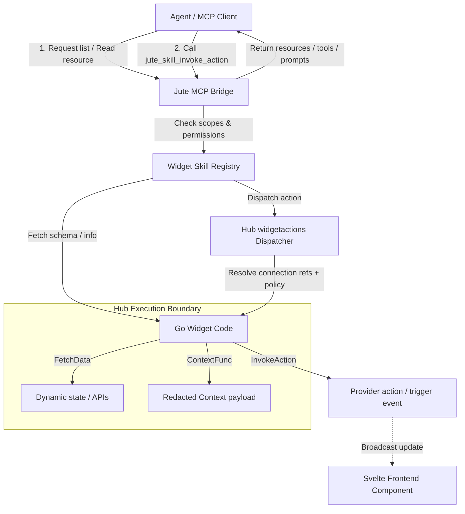

# Widget Skills

## Goal

Widget Skills are the contract that lets agents understand what a Jute widget can see and safely do.

Widgets are not just visual panels. A widget may also expose:

- public context the agent can read;
- prompts that explain how to use that context;
- actions that the hub can safely perform on the widget's behalf;
- ability metadata that helps the agent choose the right widget for a task.

The hub is the only authority that turns widget declarations into agent-visible capabilities. Widgets never call MCP directly, and agents never call widget components directly.

## Relationship To A2A And MCP

A2A remains the conversation and task protocol. Widget Skills do not replace A2A messages or Agent Cards.

MCP is the local pull/tool surface for trusted agents. The MCP Bridge exposes Widget Skills as resources, prompts, and tools after applying hub policy, widget permissions, visibility, and per-agent scopes.

The relationship and routing look like this:



The compact A2A dashboard-context extension may include a summary of currently relevant Widget Skills, but full action invocation goes through MCP, Display, or future Agent entry points that all call the same hub dispatcher.

## Skill Model

Each widget instance may expose one Widget Skill. Multiple instances of the same widget type can expose separate skills because their state, settings, room, and visible context may differ.

Skill identity:

- `skillId`: stable capability ID, such as `jute.weather.current`.
- `widgetInstanceId`: the dashboard widget instance exposing the skill.
- `widgetKind`: widget type, such as `weather`, `date-time`, or `chat-history`.
- `connectionRefs`: optional widget instance references to shared Adapter Connections. These are IDs only, not credentials.
- `displayName`: short user-facing name.
- `summary`: hub-reviewed capability summary for agents.

Skill availability is dynamic. A skill is available only when the widget exists, is allowed by policy, has required permissions, and matches the configured visibility policy.

## Skill Definition Contract

Every widget declares its agent-facing skill programmatically by implementing the Go `Widget` interface and returning a `*widgetskills.Definition` from `Skill()`. The Hub retrieves all registered widget definitions at startup to build the Widget Skill Registry.

```go
func (w *MyWidget) Skill() *widgetskills.Definition {
	return &widgetskills.Definition{
		SkillID:             "com.example.energy-price.current",
		WidgetKind:          "energy-price",
		DisplayName:         "Energy Price",
		Summary:             "Read current energy tariff and identify cheaper upcoming usage windows.",
		RequiredPermissions: []string{"agent:skill"},
		VisibilityPolicy:    "visible_or_focused",
		ContextFields: []widgetskills.Field{
			{
				Name:        "tariffName",
				Type:        "string",
				Description: "Current tariff display name.",
				Sensitivity: "public",
			},
			{
				Name:        "currentPrice",
				Type:        "number",
				Description: "Current import electricity price.",
				Sensitivity: "public",
			},
			{
				Name:        "nextCheapWindow",
				Type:        "string",
				Description: "Next known cheaper usage window.",
				Sensitivity: "public",
			},
		},
		Actions: []widgetskills.Action{
			widgetskills.ReadAction(
				"refresh",
				"Refresh tariff data",
				"Ask the widget to refresh its tariff data through the hub.",
			),
		},
		Prompts: []widgetskills.Prompt{
			{
				ID:      "energy_usage_advice",
				Title:   "Energy usage advice",
				Purpose: "Guide the agent when answering questions about cheaper appliance usage times.",
			},
		},
		SupportedWidgetSizes: []string{"small", "medium", "wide"},
	}
}
```

Declaring a skill is optional. Visual-only widgets should return `nil` from `Skill()`. Agent-visible widgets must return a complete `*widgetskills.Definition`.

Required skill definition fields:

- `SkillID`
- `WidgetKind`
- `DisplayName`
- `Summary`
- `RequiredPermissions`
- `VisibilityPolicy`
- `ContextFields`

Optional skill definition fields:

- `Actions`
- `Prompts`

Field rules:

- `SkillID` uses reverse-DNS or `jute.*` naming and must be stable across versions.
- `Summary` is a short capability description, not an instruction to the model.
- `RequiredPermissions` must be a subset of the widget's authorized permissions.
- `VisibilityPolicy` is `visible`, `focused`, `visible_or_focused`, or `always` for v1. `always` covers `headless`-mode instances, which are active and feed the agent but render no tile.
- `ContextFields`, `Actions`, and `Prompts` must use stable IDs because agents may learn or cache them.

## Context

Skill context is the safe public state an agent may read.

Rules:

- context fields must be explicitly declared;
- each value must be produced by the hub or by hub-approved widget state;
- context includes freshness metadata where possible;
- a widget instance exposes context when it is present on the profile in either `ui` or `headless` mode; `headless` is the supported way to feed agent context without rendering a tile;
- removed instances (`visible: false`) expose no context;
- hidden widgets do not expose context unless a background policy such as `headless` explicitly allows it;
- exact presence, private notes, raw adapter payloads, secrets, camera frames, microphone audio, browser storage, and undeclared fields are never context.

`contextPolicy.publicFields` is replaced by `agentSkill.context.fields`. Existing POC code may still use public fields internally until the new contract is implemented, but new architecture work should use Widget Skills.

Supported context field types for v1:

- `string`
- `number`
- `integer`
- `boolean`
- `enum`
- `datetime`
- `duration`
- `object`
- `array`

Each context field must include:

- `name`
- `type`
- `description`

Optional field metadata:

- `unit`
- `enumValues`
- `nullable`
- `freshness`
- `sensitivity`

Only `sensitivity: public` fields may be exposed to agents. If omitted, the hub treats the field as public only when it is declared in `agentSkill.context.fields` and produced by hub-approved state.

## Actions

Actions are hub-mediated operations a widget skill can perform.

Action side-effect levels:

- `read`: refresh, recalculate, or retrieve widget-owned data.
- `display`: focus, highlight, notify, expand, or otherwise change the display.
- `configure`: change widget settings or layout after explicit user approval.
- `home_action`: future smart-home action request requiring hub policy and confirmation.

Action rules:

- every action must have a stable ID and JSON Schema input/output;
- display, configure, and home actions require opt-in scopes;
- actions execute through the unified hub dispatcher, not through direct MCP-to-widget or direct display-to-provider calls;
- the dispatcher resolves Widget Instance, Widget Skill action, actor type, connection references, resolved connection material, confirmation policy, and safe issue/result mapping;
- actions return safe public results;
- failed actions return recoverable safe errors;
- `sideEffect` and `requiresConfirmation` are authoritative;
- any action marked `requiresConfirmation: true` requires confirmation for every actor;
- low-risk display-originated media/light actions may execute immediately when the action declaration does not require confirmation.

For v1, Integration Widgets use the generic route `POST /api/v1/widgets/{widgetInstanceId}/actions/{actionId}`. MCP and agent action entry points must route through the same dispatcher behavior.

Required action fields:

- `id`
- `title`
- `description`
- `sideEffect`
- `requiresConfirmation`
- `inputSchema`
- `outputSchema`

Action IDs are local to the skill and should be stable. The MCP Bridge invokes actions as `{ skillId, widgetInstanceId?, actionId, arguments }` through the generic `jute_skill_invoke_action` tool.

## Prompts

Widget Skill prompts are reusable guidance fragments for agents.

Prompt rules:

- hub-authored prompts are trusted project guidance;
- prompt declarations in Go widget definitions are reviewed as part of the contribution PR — they are trusted once merged;
- MCP prompt output should be generated from stable hub templates;
- prompt text must not include secrets, hidden state, or private widget data;
- prompts guide the agent but never grant permission.

For future manifest-backed widgets, a manifest may declare prompt purpose and expected use, but the hub will still decide the final prompt content exposed to agents.

Required prompt fields:

- `id`
- `title`
- `purpose`

Optional prompt fields:

- `arguments`
- `examples`

Prompt declarations must describe intended use. They must not contain raw model instructions that override Jute policy, ask the model to ignore permissions, or imply hidden context exists.

## MCP Mapping

The MCP Bridge exposes Widget Skills through generic skill resources and tools.

Resources:

- `jute://skills`: available Widget Skills for the connected agent.
- `jute://skills/{skillId}`: skill definition, visible widget instances, context schema, action summaries, and prompt summaries.
- `jute://skills/{skillId}/context`: current public context for a skill.
- `jute://widgets/{widgetInstanceId}/skill`: mapping from a widget instance to its exposed skill.

Tools:

- `jute_skill_list`: list available Widget Skills.
- `jute_skill_read_context`: read current public context for a skill or widget instance.
- `jute_skill_invoke_action`: invoke a declared action through the hub.
- `jute_skill_prompt_get`: get hub-approved prompt guidance for a skill.

Hub-level MCP tools, such as display notification or focus, may still exist. Widget-owned behavior should be exposed through `jute_skill_invoke_action`.

## Initial Built-In Skills

Initial built-in widgets should expose these skills:

- `jute.date_time.current`: read date, time, timezone, locale, and display format.
- `jute.weather.current`: read weather condition, temperature, humidity, wind, sunrise, sunset, and freshness.
- `jute.chat_history.current`: read available agents, selected agent, recent conversation summaries, and conversation availability.

These skills should be instance-aware even if the first dashboard only has one instance of each widget.

## Permissions And Scopes

Widget permission:

- `agent:skill`: allow the widget to expose a Widget Skill to hub-approved agents.

MCP scopes:

- `skills:read`: list skills and read skill definitions.
- `skills:context_read`: read current public skill context.
- `skills:action_invoke`: invoke safe skill actions.
- `skills:prompt_read`: read hub-approved skill prompts.

The hub may map these scopes onto broader POC scopes while the implementation is small, but the public contract should use skill scopes.

## Validation Failure Behavior

Invalid Widget Skills are disabled, not partially exposed.

The hub should reject or disable a skill when:

- `skillId` is missing, unstable, or duplicated for the same widget instance;
- required permissions are not declared by the widget;
- the visibility policy is unsupported;
- context fields are missing required metadata;
- action schemas are invalid JSON Schema;
- action side-effect levels are unsupported;
- prompts contain raw secrets or policy-bypassing instructions;
- the widget is hidden or lacks the required permission grant.

When a skill is disabled, MCP resources omit it and A2A dashboard context does not mention it. The widget may still render visually if its visual manifest is valid.

## Safety Rules

- The hub validates and normalizes every skill before exposing it.
- The hub generates MCP tool descriptions from stable templates.
- Go widget skill summary and prompt text must not contain raw model instructions that override Jute policy or bypass permissions.
- Agents cannot access private widget state, hidden widget state, raw credentials, raw smart-home adapter payloads, camera frames, microphone audio, or browser storage.
- Widgets cannot grant themselves agent access; users or trusted config grant permissions.
- Agents should treat skills as available capabilities, not as user intent.

## Implementation Order

1. Document the Widget Skill contract.
2. Add skill definitions inside `date-time`, `weather`, and `chat-history` Go widgets.
3. Build the Hub Widget Skill Registry to read and validate registered Go widget skills at startup.
4. Build the MCP Bridge around generic skill resources and tools.
5. Add per-agent skill scopes.
6. Add approval-gated configure and home-action skills later.
