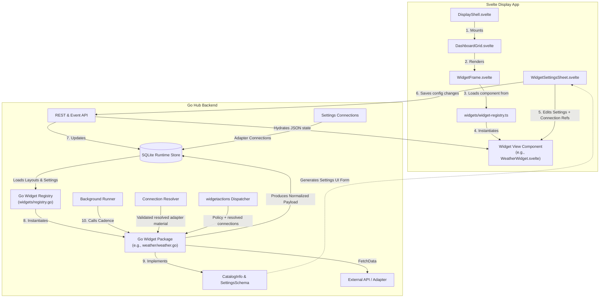

# Widgets

## Strategy

Jute Dash's widget ecosystem is designed for maximum speed, visual polish, and ease of development. All widgets are compiled natively as **first-party Svelte components** on the frontend and **Go packages** on the backend.

There are no sandboxed iframes, postMessage bridges, or third-party runtime sandboxing layers. This choice enables:
- **Flawless UI Integration**: Widgets blend natively with our black-on-white (BOW) and white-on-black (WOB) display design system, supporting smooth layout resizing, theme swapping, and hover micro-animations.
- **Maximum Performance**: Fast, direct client-side Svelte execution and direct Go data aggregation without the processing overhead of multi-process iframe containment.
- **Simplified Development**: To add, understand, or edit a widget, a developer only needs to open one unified directory.

All widgets are visually hosted in the dashboard `WidgetFrame` specified in [Display UX](display-ux.md).

Widget frame styling, transparency, and background blending are host-owned display concerns specified in [Visual Customization](visual-customization.md). Widget code should not hard-code opaque surfaces when theme tokens or widget chrome classes are available.

Widgets also declare agent-facing capabilities through [Widget Skills](widget-skills.md). The hub uses this contract to expose widget capabilities through A2A dashboard context and the optional MCP Bridge.

Integration Widgets such as Spotify, Apple Music, Philips Hue, and Zigbee2MQTT are connection-aware. They keep provider behavior self-contained, but credentials, shared connection records, secret resolution, health issues, normalized runtime payloads, and action dispatch are hub-owned concerns.

The runtime widget architecture is illustrated below:



---

## Monorepo Widgets Library

All widgets live in the unified **monorepo widgets library** under the root `widgets/` directory.

Each widget occupies its own self-contained subfolder containing:
1. A **Hub package** (`hub/`, e.g., `widgets/rss/hub`) representing catalog metadata, settings schema, runtime fetching, connection requirements, actions, and skill definitions under a package named for the widget kind.
2. Optional **private provider code** (`hub/internal/provider/`) for remote APIs, local adapter protocols, token refresh, MQTT clients, and provider DTOs that should not become shared Hub contracts.
3. A **Svelte view** (`web/[Name]Widget.svelte`, e.g., `widgets/rss/web/RSSWidget.svelte`) rendering the front-end interface. Larger widgets may keep widget-private Svelte components under `web/components/`.

```text
widgets/
  datetime/
    hub/
      datetime.go
    web/
      DateTimeWidget.svelte
  rss/
    hub/
      rss.go
    web/
      RSSWidget.svelte
  spotify/
    hub/
      spotify.go
      internal/
        provider/
          provider.go
    web/
      SpotifyWidget.svelte
      components/
```

### Svelte Resolution ($widgets alias)
Frontend imports resolve outside the Vite project root via the `$widgets` path alias:
```typescript
import RSSWidget from '$widgets/rss/web/RSSWidget.svelte';
```
Vite file system permissions are proactively granted inside `apps/web/vite.config.ts` via `server.fs.allow`.

### Dynamic Go Self-Registration
Backend packages self-register with Jute's catalog and dynamic skill registries via package initialization (`init()`). Since Go compiles package files together, importing a package automatically registers its widgets.

To maintain clean and acyclic Go package dependencies (since subpackages import the root `widgets` package to register), all package blank imports are consolidated inside [main.go](file:///Users/craig/Repos/jute-dash/apps/hub/cmd/juted/main.go):
```go
import (
	_ "jute-dash/widgets/chathistory/hub"
	_ "jute-dash/widgets/datetime/hub"
	_ "jute-dash/widgets/markets/hub"
	_ "jute-dash/widgets/rss/hub"
	_ "jute-dash/widgets/weather/hub"
)
```
This guarantees that any server context automatically compiles and loads all widgets.

### Workspace Tooling Alignment
To align monorepo workspace tooling, a symbolic link `widgets/node_modules -> ../apps/web/node_modules` allows Svelte compilers (`svelte-check`), TypeScript checkers, linters, and IDEs to flawlessly resolve external dependencies inside the root widgets directory.

---

## Contract Layers

The widget system is structured around three key contracts:

- **Frame contract**: every widget renders inside a native Svelte `WidgetFrame` and obeys the dashboard grid layout, sizing coordinates (`x`, `y`, `w`, `h`) on the 12-column base grid, and edit-mode rules from [Display UX](display-ux.md).
- **Visual contract**: every widget uses theme tokens and supports the host's `solid`, `clear`, `smoked`, `frosted`, or `auto` widget chrome modes from [Visual Customization](visual-customization.md).
- **Backend contract**: widgets implement the `Widget` Go interface in `widgets/widget.go` to provide static metadata, a settings schema, fetching and caching logic, and agent-facing skills.
- **Connection contract**: Integration Widgets optionally declare `ConnectionRequirement` records and implement connection-aware runtime/action interfaces. The hub resolves their `connectionRefs` before widget code runs.
- **Agent contract**: widgets expose agent-facing context, prompts, and actions through [Widget Skills](widget-skills.md).

---

## Widget Modes

Each widget instance has a `mode`:

- `ui`: the widget renders a tile in the dashboard grid and (if it declares one) also exposes its skill/context to agents.
- `headless`: the widget renders **no** tile. It still runs `FetchData` on its normal cadence and still exposes its skill/context to agents.

Headless mode is for context-only or sensor-like use: a widget contributes household context to the conversation pipeline without occupying screen space. Because every built-in widget already declares a skill, any widget can be added as headless.

`mode` is distinct from the `visible` field. `visible: false` means the instance has been removed from the profile (no fetch, no context). `mode: headless` means the instance is active (fetch + context) but not drawn. The hub includes a widget instance in data hydration and agent context when it is not removed — that is, when it is `ui` **or** `headless` — and excludes only removed instances.

Headless instances are added, configured, and removed from the **headless tray** in edit mode (see [Display UX](display-ux.md)).

## Settings Schema

Widgets declare a typed settings schema so the display can render a settings form without bespoke per-widget UI, and so the hub can validate and introspect settings.

The Go `Widget` interface exposes `CatalogInfo() WidgetCatalogItem`, which contains a `SettingsSchema []SettingField` list. Each field declares:

- `id`: settings key;
- `type`: one of `string`, `number`, `boolean`, `enum`, `string-list`, or `object-list`;
- `label`: human-facing label;
- `default`: default value;
- `options`: allowed values for `enum`;
- `fields`: nested `SettingField` list for `object-list` items (e.g. RSS `feeds` of `{name, url}`).

The schema is surfaced through the widget catalog API alongside the catalog metadata, and a single generic form renderer in the display builds the settings sheet from it. Frame-level settings (title, chrome, size, and `mode`) are common to all widgets and are not part of the per-widget schema.

Widget `settings` are non-secret per-instance display/configuration values only. Credentials, tokens, bridge users, broker passwords, OAuth material, and other sensitive provider setup values belong to shared Adapter Connections.

## Adapter Connections

Integration Widgets declare required connection slots in catalog metadata:

- `slot`: local name used by the widget, such as `account`, `bridge`, or `broker`;
- `kind`: Adapter Connection kind, such as `spotify`, `apple-music`, `philips-hue`, or `zigbee2mqtt`;
- `displayName` and `description`: safe setup copy for the display;
- `required`: whether the widget can run without the connection;
- `fields`: typed setup fields rendered by Settings `Connections`. Each field declares `id`, `label`, `type`, `help`, `required`, `secret`, optional `default`, and optional enum values.

Each widget instance stores:

```json
{
  "settings": { "chrome": "auto" },
  "connectionRefs": { "account": "living-room-spotify" }
}
```

`connectionRefs` is typed widget instance metadata, not widget settings. It maps declared slots to shared Adapter Connection IDs. Settings `Connections` owns creation and linking/setup flows with typed fields for built-in connection kinds; widget settings sheets only select the required shared connection for that instance.

The hub resolver validates required non-secret settings and required secret references before widget runtime or action code runs. It returns one resolution result: resolved adapter-scoped material plus the first safe issue in declared requirement order. Raw secret material is resolved only inside Hub process memory and is passed only to connection-aware Go widget code. Public API projections include connection IDs and safe connection metadata, never resolved secrets.

## Runtime Payloads

Hydrated widget data uses a normalized payload shape:

```json
{
  "status": "ok",
  "updatedAt": "2026-06-13T12:00:00Z",
  "data": {}
}
```

When a widget cannot render useful provider data, the hub/widget returns:

```json
{
  "status": "unavailable",
  "issue": {
    "code": "connection.missing",
    "severity": "warning",
    "title": "Connection needed",
    "message": "Choose a shared Adapter Connection for this widget.",
    "action": { "label": "Open settings", "target": "settings" }
  }
}
```

The display renders `issue.title`, `issue.message`, and any safe action in `WidgetFrame`. Widgets should not emit ad hoc `is_configured` or raw `error` payload fields.

## Actions

All widget actions use:

```text
POST /api/v1/widgets/{widgetInstanceId}/actions/{actionId}
```

The Hub-owned `widgetactions` dispatcher resolves the widget instance, Widget Skill action declaration, actor type, `connectionRefs`, resolved connection material, confirmation policy, and safe result/issue. Display, MCP, and agent action paths must share this dispatcher behavior. `Server` handlers only parse HTTP and write responses; they do not own provider action policy.

## Security and Persistence Constraints

All widgets must adhere to the following security and storage rules:
- **Secure Local SQLite Storage**: Widget configuration, device layouts, and integration details are stored in the local SQLite runtime database (`jute.db`) as household durable settings. They must not be stored in browser local storage or transient client-side stores.
- **Credentials Redaction**: Sensitive integration credentials (such as API keys, client secrets, and auth tokens) must never be returned in plain text in public API config projections or exposed to A2A agents / MCP contexts. They must be redacted, masked, or replaced with secure references.
- **Shared Connections**: Integration credentials are declared as Adapter Connection requirements and linked by `connectionRefs`; widgets must not write credential or token state directly into layout settings.
- **No Direct Remote Calls**: Svelte components must not communicate directly with remote APIs or cloud systems. All external operations must go through the Go hub backend.

---

## Core Widgets

Jute Dash ships with first-class built-in widgets:

1. **Date & Time (`date-time`)**: Clock, date, timezone, and locale synchronization.
2. **Weather (`weather`)**: Current apparent temperature, humidity, wind, and conditions using Open-Meteo.
3. **Chat History (`chat-history`)**: Recent conversation turns, active A2A agent status, and a quick re-entry chat button.
4. **RSS Feed (`rss`)**: headlines aggregator from custom RSS xml streams with background caching.
5. **Markets (`markets`)**: Stock, commodity, or crypto tickers watchlist using Yahoo Finance.
6. **Spotify (`spotify`)**: Spotify playback state and controls through a shared Spotify Adapter Connection.
7. **Apple Music (`apple-music`)**: Apple Music playback state and controls through a shared Apple Music Adapter Connection.
8. **Philips Hue (`philips-hue`)**: Hue light state and low-risk controls through a shared Hue bridge Adapter Connection.
9. **Zigbee2MQTT (`zigbee2mqtt`)**: Zigbee device state and low-risk controls through a shared MQTT broker Adapter Connection.

---

## Developer Guidelines

To build a new widget:
1. Create a folder `widgets/[name]/`.
2. Implement your backend provider in `widgets/[name]/hub` under `package [name]`. Make sure it registers itself inside `init()`, and declare non-secret settings plus any required Adapter Connections in `CatalogInfo()`.
3. Add a blank import for your subpackage in `apps/hub/cmd/juted/main.go` to trigger auto-registration.
4. Implement your frontend view in `widgets/[name]/web/[Name]Widget.svelte`.
5. Import and register your view inside [widget-registry.ts](file:///Users/craighutcheon/Repos/Other/jute-dash/widgets/widget-registry.ts).
6. Document usage, settings schemas, and examples in a `README.md` file inside your widget folder.
