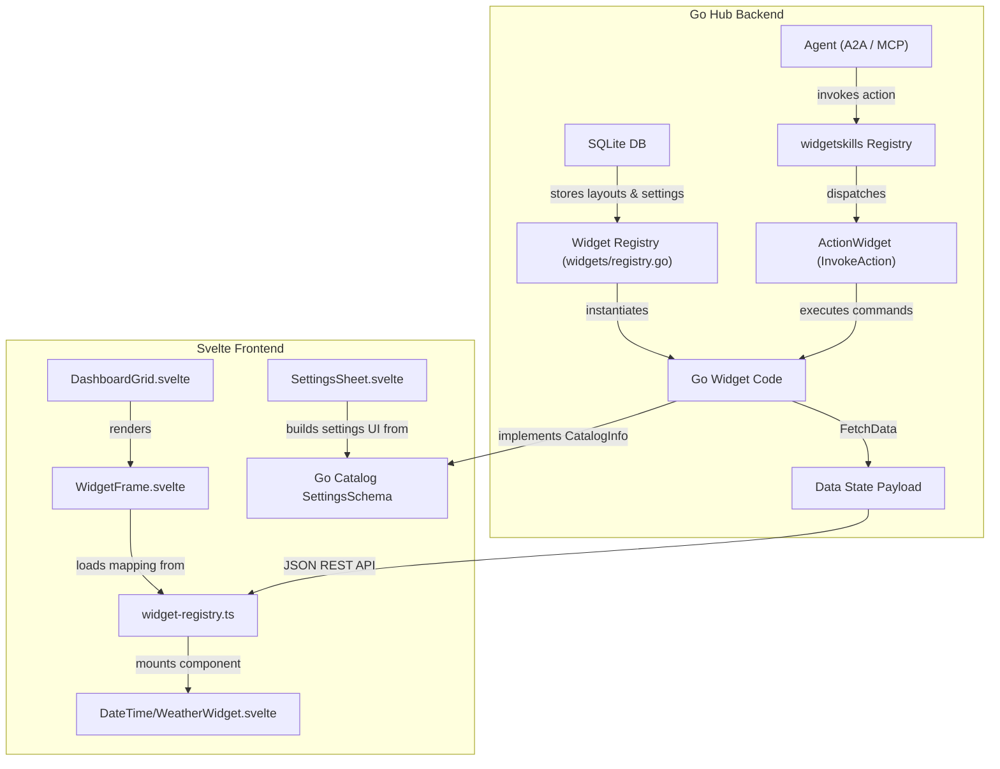

# Widget Developer Guidelines

## Overview

Jute Dash's widget ecosystem is a unified, high-performance, and **monorepo-driven native library**. Both the back-end data fetching and scheduling logic (written in Go) and the front-end display view (written in Svelte) live side-by-side inside a single widget directory under the root `widgets/` folder.

There are no sandboxed iframes, manifests, or postMessage message protocols. Everything compiles and executes natively within Jute's own runtime.

---

## Widget Folder Structure

Every widget lives in its own subdirectory under `/widgets/`:

```text
widgets/
  [name]/
    [name].go                 # Backend Go provider
    [Name]Widget.svelte       # Frontend Svelte view component
    README.md                 # Usage documentation and settings schema
```

---

## 1. Backend Implementation (Go)

Your Go file must define a package named after the widget's kind (e.g. `package weather` in `widgets/weather/weather.go`) and implement the `Widget` interface defined in `widgets/widget.go`:

```go
type Widget interface {
	// Kind returns the unique string identifier for the widget (e.g. "weather", "rss").
	Kind() string

	// CatalogInfo returns the static registration metadata.
	CatalogInfo() WidgetCatalogItem

	// FetchData gathers and aggregates the latest state/payload for this widget.
	// It is passed the widget's custom settings from the YAML file.
	FetchData(ctx context.Context, settings map[string]any) (any, error)

	// Skill returns the optional agent-facing skill metadata. Returns nil if visual-only.
	Skill() *widgetskills.Definition
}
```

### Self-Registration
During `init()`, register your widget with the global registry:

```go
func init() {
	widgets.Register(&MyWidget{})
}
```

### Server Instantiation (Blank Imports)
To trigger the widget's `init()` block, add a blank import for your subpackage inside Jute's main entrypoint [main.go](file:///Users/craig/Repos/jute-dash/apps/hub/cmd/juted/main.go):

```go
import (
	_ "jute-dash/widgets/mywidget"
)
```
This guarantees dynamic registration upon server boot while preventing Go circular import cycles.

---

## 2. Frontend Implementation & Svelte Registry

Your Svelte view must be named `[Name]Widget.svelte` (e.g. `WeatherWidget.svelte`).

### Svelte Widget Registry
Rather than manually hardcoding components in layouts, all widgets must register their frontend component and prop mapper inside [widget-registry.ts](file:///Users/craighutcheon/Repos/Other/jute-dash/widgets/widget-registry.ts). Each entry maps the widget `kind` to a Svelte component and a `props` mapping function:

```typescript
export const widgetRegistry: Record<string, WidgetRegistryEntry> = {
  'date-time': {
    component: DateTimeWidget,
    props: ({ widget, stale }) => ({
      settings: {
        timezone: 'UTC',
        locale: 'en',
        style: 'digital',
        ...(widget.settings || {})
      },
      stale
    })
  }
};
```

The prop builder receives the database `widget` instance (containing `widget.settings` and `widget.data` payload), a `stale` boolean, and the global chat states.

### Path Alias Resolution
To import your Svelte view inside the registry, use the `$widgets` path alias which points to the repository root:

```typescript
import MyWidget from '$widgets/mywidget/MyWidget.svelte';
```

### Vite File System Permissions
Because widgets live outside the SvelteKit project directory (`apps/web`), Vite restricts file system access by default. Ensure the path is explicitly allowed inside `apps/web/vite.config.ts`'s `server.fs.allow` configuration.

---

## 3. Widget Settings Generation

Jute Dash automatically generates settings forms in the settings sheet UI using the widget's Go `CatalogInfo().SettingsSchema`. Developers do not need to write form markup.

### Supported Field Types
Map your configuration using the `SettingFieldType` enums defined in `widgets/widget.go`:
- `SettingString` (`"string"`): Standard text input.
- `SettingNumber` (`"number"`): Numeric input.
- `SettingBoolean` (`"boolean"`): On/off checkbox.
- `SettingEnum` (`"enum"`): Dropdown list selector. Must supply `Options []string` list.
- `SettingStringList` (`"string-list"`): Dynamic array of strings.
- `SettingObjectList` (`"object-list"`): Dynamic array of objects. Must supply sub-`Fields []SettingField`.

---

## 4. Widget Skills & Agent Context

If your widget is agent-visible, define its `Skill()` return structure to declare what an agent can see and do through A2A or MCP:

- **Context fields**: Expose public fields (e.g., current prices, apparent temperatures) that an agent is allowed to read.
- **Actions**: Define safe, hub-mediated commands (like refreshing data) with input and output JSON schemas.
- **Prompts**: Provide high-level guidance explaining the widget's purpose.

*Note: Never expose secrets, OAuth credentials, raw database rows, or private metadata inside your widget's context fields.*

---

## 5. UI & Styling Guidelines

- **Theme Compliance & CSS Variables**: Use Jute Theme Pack tokens rather than hardcoded hex colors. Widgets inherit the display root's CSS custom properties down the DOM cascade. You should use the following inherited variables inside your Svelte `<style>` blocks:
  - `var(--foreground)`: Default text color.
  - `var(--muted)`: Secondary/de-emphasized text color.
  - `var(--muted-strong)`: Stronger muted text.
  - `var(--border)`: Default border color.
  - `var(--border-strong)`: High-contrast borders.
  - `var(--surface-muted)`: Background color for muted elements (e.g. table headers, card list backdrops).
  - `var(--surface-strong)`: Background color for highlighted visual elements.
  - `var(--active)`: Accent/active state colors.
  - `var(--success)`, `var(--warning)`, `var(--danger)`: Semantic state indicator colors.
- **Widget Chrome**: Design for `solid`, `clear`, `smoked`, `frosted`, and `auto` host chrome modes. Do not assume an opaque widget background.
- **Hover Micro-Animations**: Use smooth CSS transitions (`transition-all`, `hover:scale-[1.01]`) to make interactions feel premium and responsive.
- **Grids & Layouts**: Design the Svelte component to fit cleanly inside the standard `WidgetFrame` at all supported grid sizes. Expose a clean empty or loading state when data is unavailable.

Visual customization rules are defined in [Visual Customization](../architecture/visual-customization.md). Widgets should leave frame background, transparency, blur, border, and background blending to `WidgetFrame`.

---

## 6. Widget Architecture

The following diagram illustrates how widgets are registered, customized, rendered, and integrated with home assistant agent actions:



---

## Contribution Checklist

When contributing a new widget:
1. **Directory**: Create `widgets/[name]/` containing `[name].go` and `[Name]Widget.svelte`.
2. **Dynamic Boot**: Blank import your package inside `apps/hub/cmd/juted/main.go`.
3. **Dashboard Mapping**: Import and register the component and its props inside [widget-registry.ts](file:///Users/craighutcheon/Repos/Other/jute-dash/widgets/widget-registry.ts).
4. **Documentation**: Write a `README.md` inside your widget folder detailing its kind, supported sizes, and custom settings schemas.
5. **Visual Verification**: Check the widget in light and dark mode, and with at least `solid` and `smoked` widget chrome.
6. **Quality Verification**: Run `make check` to verify Go compilation, backend package tests (`go test ./...`), and SvelteKit type checks (`make web-check`).
